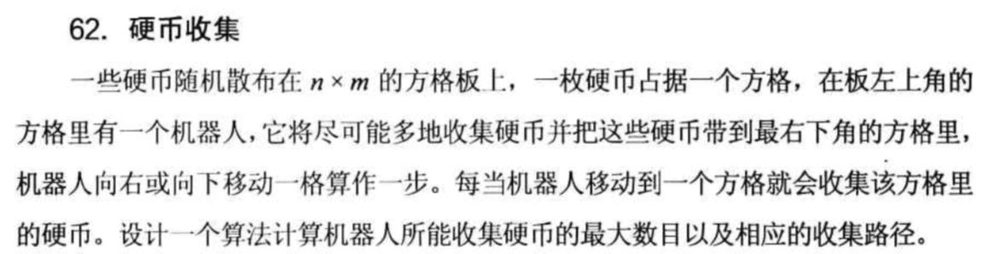

# 算法谜题
***
[美]Anany Levitin  Maria Levitin 著
赵勇 徐章宁 高博 译
人民邮电出版社 2014年3月
***
该笔记是对本书的总体笔记，如果感觉此谜很有意思，可能有单独的博客，来叙述该问题。
<!-- more -->
## 第一章 概要
### 穷举搜索(exhaustive search)
直截了当地试遍所有的可能解，直到找到问题的解为止。很少需要人工计算，为计算机准备，可能复杂度是指数级的，效率低下。

### 回溯法(backtracking)
一次添加一个组件，并进行以下评估：如果这个中间构造可以再向前推进一步，而不违反题设的约束，则选择第一个合法组件作为下一个组件；如果找不到合法构造，则不再考虑任何其余部件，此时需回溯。
回溯算法可以对应一颗反映决策过程的树，称为**状态空间树**。状态空间树的叶节点有两种可能的类型：
1. **无望结点(nonpromising node)或死路结点(dead end)** 即不可能达成解得半成品。一旦构造出这类点，回溯算法会中止该节点(称为树的**剪枝**)。
2. **解结点** 
经典场景：n皇后问题(回溯+对称)
//（1）装载问题（2）0-1背包问题（3）旅行售货员问题（4）八皇后问题（5）迷宫问题（6）图的m着色问题

### 减而治之(decrease-and-conquer)
从给定问题的解及其较小规模谜面的解之间找到某种关系，导向某种**递归**算法。可以从最大规模谜面出发，或者从最小规模谜面出发。
经典场景：名流问题(任选两人——甲和乙，甲认识乙->甲不是名流，甲不认识乙->乙不是名流)、猜数字

### 分而治之(divide-and-conquer)
把一个问题划分成若干较小的子问题，然后各个击破，最后在必要时把子问题的解组合起来，就得到了原始问题的解。
经典场景：三格骨牌谜题(中间放个L使得四块都缺一格)
+ 分而治之和减而治之的区别在于每一步需要解决的子问题个数: 分治算法每一步需要解决多个子问题，而减治算法则仅需要解决一个。

### 变而治之(transform-and-conquer)
变换: 某个问题被修改或变换成另一个问题，出于某种理由，修改和变换后的问题较容易求解。三种变体: 
+ 谜面简化(instance simplification)，即首先将问题的一个谜面变换成同样问题的另一个谜面，而该谜面因为某种特殊性较易求解。
+ 表示变更(representation change)，即把问题的输入变换成另一种表示，从而更易找到有效算法求解。
+ 问题归约(problem reduction)，即把给定的谜面整体转化成另一个问题的谜面。可能涉及到 **状态空间图(state-space graph)**，将问题归约到在初始状态顶点和目标状态顶点之间寻找一条路径的问题。

经典场景: 变位词检测(表示变更、字母重新排序)、现金分装(进制表示、表示变更)、两个吃醋的丈夫(问题归约、状态空间图)、Guarini谜题(问题归约、状态空间图)、最优馅饼切法

### 贪心法(greedy approach)
采用贪心法求解最优化问题，就是经过一系列步骤，每次对一个部分构造的解进行扩展，知道达成一个完整的解为止。
每一步怎么走，取决于如何能够产生最大的短期收益，并且不违反题设的约束，把希望寄托于局部最优解的序列可以最终产出整个问题的(全局)最优解。这种解法某些情况不奏效。奏效的情况下最好也证明下...
经典场景：不可互攻的王、夜过吊桥(不可用其解)

### 迭代改进
从易得的估计解触发，并重复地应用同样的简单步骤不断地改进估计解。要验证这种算法，就需要确认存疑的算法是否真的可以在有穷步内终止，最终得到的估计解是否真的解决了问题。
单变性：
+ 值只会向一个期望的方向改变
+ 只存在有限个值，这就保证了在有限步以后算法必会终止。
+ 得到最终值以后，问题得以解决。

单变性(monovariant)的扩展-> 单纯形法(simplex method)
经典场景: 柠檬水摊设点、正数变号

### 动态规划
用来解决有着彼此重叠子问题的问题。其解法并不是一遍遍的对彼此重叠的子问题求解，而是只对较小规模的子问题求解一次，把结果记录在一个表格中，而原问题的解就可以从表格中得到。对要用该方法求解的最优化问题而言，需要具备**最优子结构**(optimal substructure)，只有这样才能从子问题的最优解有效地构造全局最优解。
动态规划是一名杰出的美国数学家Richard Bellman在20世纪50年代，作为求解多阶段决策过程的通用方法提出。
经典场景：最短路径计数

### 递归算法
求解递归关系式(recurrence relalion), 设定初始条件(initial condition)。
经典场景：汉诺塔

### 不变量
所谓**不变量(invariant)，就是在任何一个算法的解题时保持不变的某种性质**。对于谜题一般的问题而言，不变量经常用来说明某个问题无解，因为称为不变量的性质在谜题的初始状态成立，而在所要求的终止状态却并不成立。奇偶配对(even-odd parity)和着色(coloring)是运用不变量思想时用的最广的两种方法。
经典场景：哥尼斯堡七桥问题、掰巧克力条、田地里的鸡

## 第二章 谜
### 简单题
#### 狼羊菜过河
还可以用立方体的定点表示(见[Ste09])
这个谜题到现在依然能够吸引数学家和计算机科学家的研究兴趣(见[Cso08])
- - -
[Ste09]Steinhaus H. One hundred problems in elementary mathematics[M]. Courier Corporation, 1964.
[Cso08]Csorba P, Hurkens C A J, Woeginger G J. The Alcuin number of a graph[M]//Algorithms-ESA 2008. Springer Berlin Heidelberg, 2008: 320-331. 
- - -

#### 手套选择
手套有左右之分。

#### 矩形切割
对于一个直角三角形而言，沿着它的高切割。
对于矩形而言，可以切成两个矩形，或者沿着矩形对角线切割成两个直角三角形。

#### 士兵摆渡
+ 两个男孩->
+ 一个男孩<-
+ 一个士兵->
+ 一个男孩<-
一个士兵过去需要两个来回，25个士兵需要50个来回(累死男孩的节奏╮(╯▽╰)╭)

#### 行列变换
不能
 ^ 行变换维持行上的数字不变，列变换维持列上的数字不变。

#### 数数的手指
余数问题

#### 夜过吊桥
第1个和第2个先过，第3个和第4个一起过
此谜题也被称为桥和电筒问题，Torsten Sillke的网站[Sillke]上有一系列与这道谜题相关的有趣材料，包括此题的一个更为普遍情况的算法，即n个人在同样的约束条件下过桥，对每个人过桥的次数不做限制。该算法的最优化证明由Günter Rote在2002年出版[Rot02]。想做进一步的延伸，参见Moshe Sniedovich的网站[Sni02]以及Roland Backhouse的论文[Bac08].
- - -
[Sillke] Sillke, T.Crossing the bridge in an hour. www.mathematik.uni-bielefeld.de/~sillke/PUZZLES/crossing-bridge(accessed Oct. 4, 2010)
[Rot02] Rote G. Crossing the bridge at night[J]. Bulletin of the EATCS, 2002, 78: 241-246.
[Sni02] Sniedovich, M. The bridge and torch problem. Feb. 2002. www.tutor.ms.unimelb.edu.au/bridge(accessed Oct.4, 2010).
[Bac08] Backhouse R. The capacity-C torch problem[C]//Mathematics of Program Construction. Springer Berlin Heidelberg, 2008: 57-78.
- - -

#### 拼图问题
基于不变量的思想

#### 心算求和
和值公式

#### 硬币中的假币
2次，因为知道轻重。
^可以通过比2大的因子简化问题。还说明了一个处理特定数字信息问题时会遇到的窘境:有时是可以利用给定数据的特点来解题，但有时也会被误导。
还存在另一种解法，使得第二次称重不依赖于第一次称重的结果。用字母A、B、C、D、E、F、G、H来标记硬币。第一次称重，比较ABC和FGH。第二次称重比较ADF和CEH。如果ABC=FGH(第一次称重的结果是平衡)，则所有6枚硬币都是真的，因此第二次称重等同于比较D和E的重量。如果ABC<FGH，则只有A、B、C可能是假的，因此如果第二次称重ADF=CEH，则B是假币；如果ADF<CEH，则A是假币；如果ADF>CEH，则C是假币。同理可用于ABC>FGH。
此谜题有一个更为一般化的版本，即针对任意数目的硬币。不过，division-into-thirds算法最优化证明需要引用到更为高阶的技术，例如决策树(如[Lev06,Section11.2])。
- - -
[Lev06] Levitin, A. Introduction to the Design & Analysis of Algorithms, 2nd edition[M], Pearson, 2006.
- - -

#### 假币堆问题
表示变更

####  平铺多米诺问题※ 
反证法。假设这样的平铺方法可以实现，由于方格板是对称的，我们假设它的左上角是被如图4.6所示的一块横置的多米诺牌1所覆盖，那么，第二行第一列的放个必然是被一块竖直排放的多米诺牌覆盖，因此同行第二列会是一块横放的多米诺牌，如此推演下去，得到图4.6所示的平铺图。在多米诺牌13之下放一块横置的多米诺牌，变成了唯一的选择。这与没有两张多米诺牌并排形成2x2的正方形的题目条件相矛盾。
* 这是一个相当罕见的证明不存在性的例子。

#### 被堵塞的路径
路径统计是动态规划法很著名的一类应用。

#### 复原国际象棋棋盘
找到必须切割的。

#### 三格骨牌平铺问题
对3x3，穷举。

#### 煎饼制作※
**对于所有的n>1，所需要的最小时间是n分钟，对于n=1，所需时间为2分钟。**
关键在于制作三个煎饼的最优方法。

#### 国王的走位※
题目: 
&nbsp;&nbsp;&nbsp;&nbsp;(a) 在国际象棋中，国王的走位是可以移动到水平、竖直或对角线上毗邻的方格里。假设国王在一张无限大小的棋盘的某一方格之中，在移动n步以后，它能到达的方格有多少个？
&nbsp;&nbsp;&nbsp;&nbsp;(b) 如果国王不能走对角线，那么上述问题的答案会有什么样的变化？
答案: 
&nbsp;&nbsp;&nbsp;&nbsp;(a)n=1时为8, n>1时为(2n+1)2。
&nbsp;&nbsp;&nbsp;&nbsp;&nbsp;&nbsp;&nbsp;&nbsp;&nbsp;&nbsp;   移动一步，国王可以到达开始点毗邻的8个方格。移动两步，它可以到达如下地方：开始的方格、毗邻于它的8个方格中的任意一个(先走到相邻的方格，再移动到最后所在的位置)，以及如图4.11a所示的16方格中的一个，这16个方格是由点串起来所形成的正方形中的中间那个。因此，所有移动两步所能到达的方格要么在这个正方形的边上，要么在这个正方形的内部。总之，在n>1次移动后，国王能到达的方格位于以开始起点为中心的(2n+1)x(2n+1)正方形的边缘或其内部(见图4.11a所示为n=3的情况)。这些方格的数目等于(2n+1)2。如果n=1, 国王只能到达邻近的8个方格，与n>1时情况不同，国王无法回到起始的方格。
&nbsp;&nbsp;&nbsp;&nbsp;(b)(n+1)2
&nbsp;&nbsp;&nbsp;&nbsp;&nbsp;&nbsp;&nbsp;&nbsp;&nbsp;&nbsp;   如果国王只能沿水平或竖直方向移动，在n步以后，不管n为偶数还是奇数，它总会停在一个与起始方格颜色相同或相反的方格之上。考虑国王在n步所能到达的最远的方格，这些方格会形成一圈边线：在这边线上的所有方格都拥有相同的颜色，并且都是国王在n步之后可达的(见图4.11b)。这样算下来，国王可到的方格有(n+1)2个。

评论：答案的正确性可以用数学归纳法做更为严格的证明。

#### 骑士的征途※ 
题目：有一枚骑士位于8x8国际象棋棋盘的左下角，有没有一种走法，使得骑士可以遍历整张棋盘并且棋盘的每一格都只走一次，最后到达棋盘的右上角？（骑士的走法是"L"型）

答案：不可能。骑士移动开始和结束的棋格永远是相反的颜色。所有棋盘上的格子都访问一次需要移动63次: 由于该数字是奇数，那么整个走棋过程应该在颜色相反的棋格上开始和结束。但是棋盘左下角和右上角的棋格颜色是相同的，所以完成整个走棋过程是不可能的。

评论：此谜题是一个标准的**发掘棋格颜色不变量**的练习题。注意有这样一个谜题，要求找出一条路径使得骑士可以遍历国际象棋8x8棋盘上的每一个棋格，若是对从对角线开始并且以对角线结束不作要求的话，问题是有解的。

#### 页码计数
计数的是用的位数的总和

#### 寻找最大和
动态规划

#### 正方形的拆分※
题目：将一个正方形拆分成n个小正方形，找出数字n的所有取值可能，并将这种拆分方法归纳成算法。

提示：对于某些n的取值，并不存在拆分的可能。注意拆分出的小正方形并不需要是一样的尺寸。

答案：一个正方形可以被拆分成n个更小的正方形(n>1但n不等于2,3,5)。
  * 考虑到正方形的四个直角必然成为更小的正方形的一部分，明显n为2、3和5时无解。n=1,4的解显而易见。
  * n=4的解可以推广到所有的偶数 n=2k: 
    在给定的正方形中，沿着相邻的两个边，划出2k-1个等大的小正方形, 每个小正方形的边长等于大正方形边长的1/k。图4.13b展示了该解法对于n=6时的情况。
  * 如果 n>5且n为奇数，即 n=2k+1 (k>2): 把上面得到的偶数个小正方形的其中一个一分为四即可。

#### 球队排名
减而治之/增量法

#### 波兰国旗问题
类似于快排

#### 国际象棋棋盘着色问题(tmp)※

####  科学家在世的最好时代※ 
题目：《全球科学史》的一名编辑想找出拥有最多卓越科学家在世的时代。所谓卓越科学家，指的是在书中提及并注有出生年份和死亡年份的科学家（还活在世上的科学家不包含在内）。设计一个算法来处理这个问题，假定将书中的索引作为算法的输入。索引中，科学家人名按字母表顺序排序，并给出其出生年份及死亡年份。假定如果出现A死亡和B出生在同一年这种情况，则认为前一个事件(A去世)发生在后一个事件(B出生)之前。

答案：对于给定n个区间(b1, d1),...,(bn, dn) ——bi, di代表索引中第i个人的出生和死亡的年份，找出所给区间中拥有最多交集数目的子区间。所有的区间都是开区间，如果 di = bj, 则认定第i个区间的右括号先于第j个区间的左括号。
将这些区间标记在一条直线上，有助于将问题变得可视化，如图4.17所示。**从左到右扫过一遍括号序列就可以得到本题的答案，碰到左括号，将计数加一，碰到右括号将计数减一: 当触及答案区间的左括号，计数到达自身的最大值。**

评论：在时间轴上将输入的数据标记成可视化的区间，是变而治之策略的应用。

#### 寻找图灵
排列组合问题

#### Icosian游戏※
评论：本谜题代表了令人着迷的图论问题中比较特殊的一类问题。问题关键在于**哈密尔顿回路(Hamilton circuit)**——有一系列相邻的顶点(由边连接)所组成的回路是否存在，从该回路的某个顶点开始，可以依次遍历一次其余各个顶点，然后再回到起始顶点。某些图拥有哈密尔顿回路，例如本题，而有些图则没有。目前没有一个有效的算法可以判断哈密尔顿回路在任意给定的图中是否存在。事实上，大多数计算机科学家不相信会有这样一个算法。尽管人们花费了50多年寻求这一猜想的证明，并且在2000年设立了100万美金作为解决这一问题的奖赏，但目前依然无解。

#### 一笔画※
一笔画的规律很久以前就得知了，这里考虑其他方面。
著名的构造**欧拉回路**的算法：
    任取一个顶点，沿着没有访问过的边前进，直到所有的边都遍历过一遍，或者留一些没能访问的边，直到回到起始的顶点。如果是后一种情况，则将遍历过的回路从原来的图中移出，然后选择一个顶点，要求该顶点是剩下的图与所移出的回路共有的顶点，再重复上述操作(顶点的存在与否取决于图的连通性和该图的顶点是否都是偶数维度)。一旦从剩下的图中构造出一个欧拉回路，就将它与最开始的回路拼接在一起构成整个图的欧拉回路。
运用了**减不定数量**的方法。

#### 重温幻方
评论：自从幻方在古代中国出现以来，人们已经为此着迷了上千年。虽然已经发明出对阶数n>2的幻方的一些构造算法，但对任意阶的幻方的数字计算公式仍未被发现。关于幻方更多的信息，读者可以参考某些专题论文(例如，[Pic02])以及许多趣味数学书籍的相关章节(例如，[Kra53, Chapter 7]), 以及众多以此为专题的万维网网站。
- - -
[Pic02] Pickover C A. The Zen of Magic Squares, Circles, and Stars: An Exhibition of Surprising Structures Across Dimensions[M]. Princeton University Press, 2002.
[Kra53] Kraitchik M. Mathematical recreations[M]. New York: Dover Publications, 1953.
- - -

#### 棍子切割
着重考虑如何处理棍子切割后的最长片段

#### 三堆牌魔术
和真假硬币差不多。
很多扑克魔术都包含一定的算法设计分析理念。

#### 单淘汰赛
在产生一个冠军后，还需要多少场比赛才能决出第二名选手？
-> 第二名选手是仅输给冠军，而没有输给其他人的选手。这些选手可以通过以下方式阻止单淘汰赛。用树来表征所有完成的比赛，找到代表冠军的叶子节点，然后假设冠军输掉了自己的第一场比赛，沿此节点向上组织选手比赛，直至到达根节点。所有这些比赛总数不会超过 ceiling(log2n)-1场。
锦标赛树在计算机科学中还有一些有趣的应用(见[Knu98])。
- - -
[Knu98] Knuth D E. The art of computer programming: sorting and searching[M]. Pearson Education, 1998.
- - -

#### 真伪幻方
注意真幻方要求对角线也满足其和，伪幻方只需要行和列。

#### 星星的硬币
贪婪法：第一次后每次都沿着一条可用的边，放置到拥有一条不能用的边的顶点上。
表示变更：展开图形。
（一笔画什么的...）

#### 三个水壶
穷举法&广度优先遍历(状态空间图)。
有一些关于这个古老谜题的小信息，它的变化和后续发展能在在线专栏上的两篇MAA中找到：一篇是由Alex Bogomolny所著[Bog00], 里面还有一个小型演示程序的链接，另一篇由Ivar Peterson所著[Pet03]。这个谜题还能通过一个使用三维坐标系作为表征的神奇方法进行求解，由M. C K. Tweedie发现[Twe39](另见[OBe65, Chapter4])。
- - -
[Bog00] Bogomolny, A. The three jugs problems. The Mathematical Association of America, May 2000. www.maa.org/editorial/knot/water.html#kasner(accessed Oct. 10, 2010)
[Pet03] Peterson, Ivar. Measuring with jugs. The Mathematical Association of America, June 2003. www.maa.org/mathland/mathtrek_06_02_03.html(accessed Oct. 4, 2010)
[Twe39] Tweedie M C K. A graphical method of solving Tartaglian measuring puzzles[J]. The Mathematical Gazette, 1939, 23(255): 278-282.
[OBe65] O'Beirne T H. Puzzles and Paradoxes: Fascinating Excursions in Recreational Mathematics[M]. Dover Publications, 1965. 
- - -

#### 有限的差异（tmp）

#### 2n筹码问题（tmp）

#### 四格骨牌平铺问题
用15块T型四格骨牌和1块正方形四格骨牌是无法平铺整个8x8棋盘的。可先对棋盘**染色&奇偶性**获得。

#### 方格遍历
对棋盘两色交替**着色**，遍历每一个方格都是颜色交替的。
评论：解法利用了着色——一个发掘不变量经常使用的方法。
需要注意的问题是，**判断哈密尔顿路径在此图中是否存在，不同于哈密尔顿环路**，哈密尔顿路径时不要求回到起点的，然而没有有效的算法可以判断一个给定的图形是否存在哈密尔顿路径。

#### 四个调换的骑士
表示变更（棋盘的图）和不变量(骑士的顺时针顺序)

#### 灯之圈（tmp）

#### 狼羊菜过河问题的另一个版本
自底向上的减而治之

#### 数字填充
题目：有n个不同的数字，还有n个一系列由>, <相连接的空格，设计一个算法将这些数字填到空格之中并满足空格之间的不等式关系。例如，数字2、5、1和0能如下填充在空格之中。

0 < 5 > 1 < 2 

答案：开始时先将数字序列按升序排序，然后重复以下操作n-1次；如果第一个不等号是“<”，将第一个(最小的)数字放到第一个空格中；如果是“>”,则将最后一个(最大的)数字放到第一个空格中。之后将这个数字从序列中删除。最终当序列只剩下唯一的数字时，将它放置在最后一个空格之中。
评论：以上算法基于两种算法设计策略——**变而治之(预排序)和减而治之(逐步减少序列中数字的个数)。需要注意的是，这不是谜题的唯一解。
(自己想的方法太麻烦了，不适合实际操作...)

#### 孰轻孰重
题目：有n>2个外观完全相同的硬币和一个没有砝码可用的双托盘天平。硬币中有一枚假币，但不知道假币是比真币轻还是重，其余的真币重量是一样的。设计一个算法，用最少的称重次数判断假币真币孰轻孰重。
提示：没有要求甄别出哪枚是假币，仅要求判断假币较其他真币的轻重。
答案：可以通过两次称重解决。
开始时，如果硬币总数n是奇数，则将一枚硬币拿出，如果n是偶数，则拿出两枚。然后将剩下总数为偶数的硬币分成等量的两组分别放到天平的两端。如果它们的重量相同，则这些都是真币，假币在拿出去的硬币中。我们拿回放在一旁的一枚或两枚硬币，用等量的真币在天平的两端称，如果前者轻，则说明假币较真币轻一些，反之说明假币重一些。
如果第一次称重的结果并不是平衡的，就选取轻一些（也可以重一些...）的硬币组，如果这组里的硬币数量是奇数的，就加一枚一开始放在一旁的硬币(真)。把这些硬币分成等量的两组，再称重，如果重量还一样，说明这些都是真币，并且假币比真币要重；如果重量不一样，说明这两组里有假币，并且假币笔真币要轻。

#### 骑士的捷径
曼哈顿距离(Manhattan distance)来衡量棋盘上两个棋格间的距离。本题n=100是一个特殊情况。

#### 三色排列(tmp)
对于任意n≥1的取值，都有解决方案。

#### 展览规划
哈密尔顿路径 + 方格着色

#### 麦乐鸡数字
减而治之。给定一个由不同自然数字构成的数字组合(这些数字的最大公因数是1)，找出无法用这些数字的线性组合表示的最大的那个正整数，这类问题被称为Frobenius Coin问题(例如，[Mic09, Section6.7])
- - -
[Mic09] Michael T S. How to guard an art gallery and other discrete mathematical adventures[M]. JHU Press, 2009.
- - -

#### 传教士与食人族
状态空间图

#### 最后一个球※(tmp)

### 中等难度
#### 缺失的数字
法一: 求其和，用1-100的和去减
法二: 做异或运算
简化：**可以用它自身的后两位唯一地表示。**
- - -
[Gar99, p.88, Problem 1] Gardiner A. Mathematical puzzling[M]. Courier Corporation, 1987.
- - -

#### 数三角形
等比数列(× 有些三角形重合了，应该是等差数列，多举例可知)

#### 弹簧秤甄别假币
二分法

#### 矩形切割
二分法

#### 里程表之谜
排列组合

#### 新兵列队
从高到低/从低到高

#### 斐波那契的兔子问题
斐波那契数列。
有两个著名的斐波那契数字公式:

现在有大量的书和网站，以及一本特殊的杂志，叫做Fibonacci Quarterly，专门研究斐波那契数列以及其相关的应用。特别是由英国数学家Ron Knott[Knott]建立的网站，其中包含一系列斐波那契数列相关的谜题。
- - -
[Knott] Knott, R. Fibonacci Numbers and the Golden Section. www.mcs.surrey.ac.uk/Personal/R.Knott/Fibonacci/ (accessed Oct.4, 2010)
- - -

#### 二维排序※ (tmp)

#### 双色帽子
博弈论里面的问题。最早的版本three men withspots on foreheads出现在1935年，由普林斯顿的著名逻辑学家Alonzo Church提出。

#### 硬币三角形变正方形※ (tmp)

#### 对角线上的棋子
连续整数和值公式和奇偶不变量。

#### 硬币收集※ (tmp)

#### 加减归零※  (tmp)

#### 构建八边形※ (tmp)

#### 猜密码
每次变1位。
这个方法对于所有n的值并不都是最优的。例如，任意5比特的密码都能通过序列00000，11100，01110，00101(Dennis Shasha所写的书[Sha07]中第105-106页)。目前尚没有通用的计算公式，确定任意n比特密码所需要的问题数目的最小值。
- - -
[Sha07] Shasha D E. Puzzles for Programmers and Pros[M]. John Wiley & Sons, 2007.
- - -