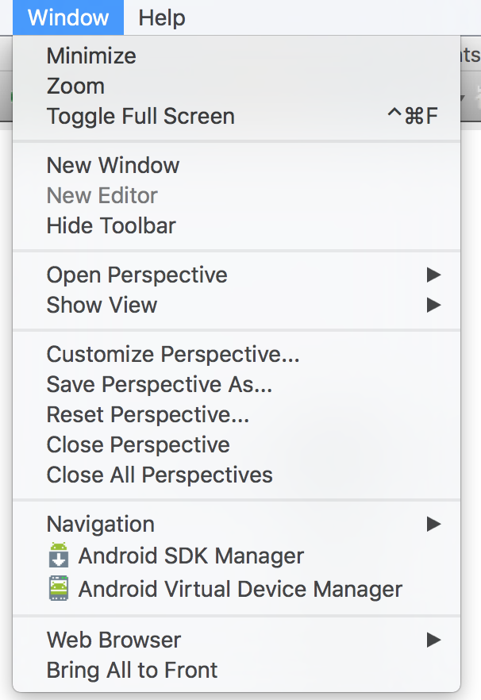
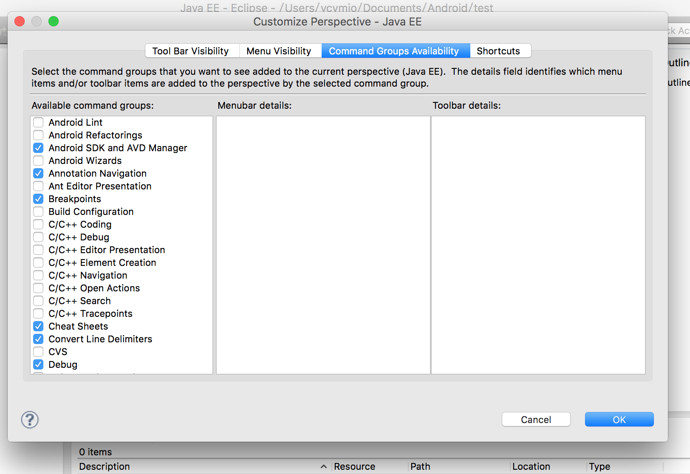

mac系统的eclipse菜单里没有Android SDK Manager, 首次配置Android的SDK(在preference里配置)时会自动运行Android SDK Manager，但由于下载的东西多，当时退出后再调用就无法再通过preference调用了。

可以通过以下方法再启动：
<!--more-->
第一种：打开终端，进入下载的Android SDK Manager目录的tools目录，输入 ./android & 启动。接下来与之前一样下载。
第二种(推荐)：在eclipse菜单的 Window -> customize Perspective -> Command Groups Availability 选中Android SDK and AVD Manager，如图1。确认后即可在Window下看到Abdriud SDK Manager和Android Virtual Device Manager，如图2.

 

图1
 

图2
