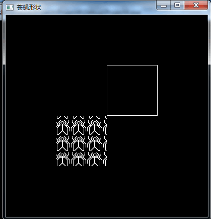
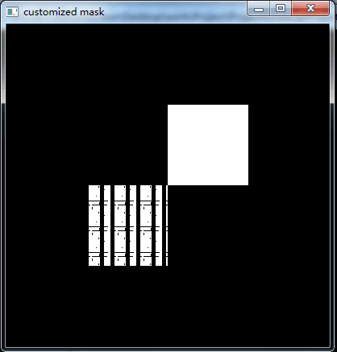

转载/参考自: [OpenGL入门学习](http://www.cnblogs.com/crazyxiaom/articles/2073586.html "OpenGL入门学习")

包括第一个OpenGL程序、绘制简单的几何图形、几何图形的细节绘制处理。
现在的《OpenGL编程指南(第8版)》很多内容已经删除了。但由于刚学，第八版并不能看懂...代码部分一般都基于OpenGL很久以前的版本。关于第八版，以后也许会补充。

<!--more-->

### OpenGL入门学习[一]: 第一个OpenGL程序

一个简单的OpenGL程序如下: (注意，如果需要编译并运行，需要正确安装GLUT）

```cpp
    #include <GL/glut.h>
    void myDisplay(void){
        glClear(GL_COLOR_BUFFER_BIT);
        glRectf(-0.5f, -0.5f, 0.5f, 0.5f);
        glFlush();
    }
    int main(int argc, char *argv[]){
        glutInit(&argc, argv);
        glutInitDisplayMode( GLUT_RGB | GLUT_SINGLE);
        glutInitWindowPosition(100, 100);
        glutInitWindowSize(400, 400);
        glutCreateWindow("Title");
        glutDisplayFunc(&myDisplay);
        glutMainLoop();
        return 0;
    }
```

该程序的作用是在一个黑色的窗口中央画一个白色的矩形。

下面对各行语句添加了注释。

```cpp
    // glut的头文件已经包括了<GL/gl.h>和<GL/glu.h>
    #include <GL/glut.h>    
    void myDisplay(void){
        /*
          glClear(): 清除指定的缓存数据并重设为当前清除值。
          GL_COLOR_BUFFER_BIT: 颜色缓存。
          GL_DEPTH_BUFFER_BIT: 深度缓存。
          GL_STENCIL_BUFFER_BIT: 模板缓存。
          OpenGL默认清除颜色为黑色，如要改变，可以使用glClearColor() ->一般在init()中设置.
         */
        glClear(GL_COLOR_BUFFER_BIT);
        /*
          glRectf(): 画一个矩形。四个参数分别表示了位于对角线上的两个点的横、纵坐标。
        */
        glRectf(-0.5f, -0.5f, 0.5f, 0.5f);
        /*
          glFlush(): 强制之前的OpenGL命令立即执行并传输到OpenGL服务端处理。
        */
        glFlush();
    }
    int main(int argc, char *argv[]){    
        /* 
          glitInit(): 初始化GLUT库，处理向程序输入的命令行参数，并且移除其中与GLUT如何操作相关的部分。必须是程序调用的第一个GLUT函数，会负责其他GLUT例程所需要的数据结构。
        */
        glutInit(&argc, argv);
        /*
          glitInitDisplayMode(): 设置程序所使用的窗口的类型。GLUT_RGB表示使用RGB颜色，与之对应的还有GLUT_INDEX(表示使用索引颜色)。GLUT_SINGLE表示使用单缓冲，与之对应的还有GLUT_DOUBLE(使用双缓冲)。
        */
        glutInitDisplayMode( GLUT_RGB | GLUT_SINGLE);
        /*
          glutInitWindowPosition(): 设置窗口在屏幕的位置
        */
        glutInitWindowPosition(100, 100);
        /*
          glutInitWindownSize(): 设置窗口大小。(可以根据屏幕动态设置大小)
        */
        glutInitWindowSize(400, 400);
        /* 有时会设置glutInitContextVersion()和glutInitContextProfile(), 即所需OpenGL环境的类型*/
        /*
          glutCreateWindow(): 创建窗口，参数为标题。要满足glutInitDisplayMode()的显示模式要求，窗口才会被创建。其后才能使用OpenGL相关的函数。
          Note：窗口被创建后，并不立即显示到屏幕上。需要调用glutMainLoop才能看到窗口。
        */
        glutCreateWindow("Title");
        // 这里有时候会调用glewInit()，看有没有GLEW辅助库。
        // 这里可以建立init()函数进行基本设置。
        /*
          glutDisplayFunc(): 设置了显示回调，即GLUT每次更新窗口内容时会调用该例程。
        */
        glutDisplayFunc(&myDisplay);
        /*
          glutMainLoop(): 无限执行的循环，负责一直处理窗口和操作系统的用户输入等操作，其后的命令不会执行。
        */
        glutMainLoop();
        return 0;
    }
```

### OpenGL入门学习[二]: 绘制简单的几何图形
#### 点、直线和多边形
我们知道数学（具体的说，是几何学）中有点、直线和多边形的概念，但这些概念在计算机中会有所不同。
数学上的点，只有位置，没有大小。但在计算机中，无论计算精度如何提高，始终不能表示一个无穷小的点。另一方面，无论图形输出设备（例如，显示器）如何精确，始终不能输出一个无穷小的点。一般情况下，OpenGL中的点将被画成单个的像素，虽然它可能足够小，但并不会是无穷小。同一像素上，OpenGL可以绘制许多坐标只有稍微不同的点，但该像素的具体颜色将取决于OpenGL的实现。当然，过度的注意细节就是钻牛角尖，我们大可不必花费过多的精力去研究“多个点如何画到同一像素上”。
同样的，数学上的直线没有宽度，但OpenGL的直线则是有宽度的。同时，OpenGL的直线必须是有限长度，而不是像数学概念那样是无限的。可以认为，OpenGL的“直线”概念与数学上的“线段”接近，它可以由两个端点来确定。
多边形是由多条线段首尾相连而形成的闭合区域。OpenGL规定，**一个多边形必须是一个“凸多边形”**（其定义为：多边形内任意两点所确定的线段都在多边形内，由此也可以推导出，凸多边形不能是空心的）。多边形可以由其边的端点（这里可称为顶点）来确定。（注意：如果使用的多边形不是凸多边形，则最后输出的效果是未定义的——OpenGL为了效率，放宽了检查，这可能导致显示错误。要避免这个错误，尽量使用三角形，因为三角形都是凸多边形）
可以想象，通过点、直线和多边形，就可以组合成各种几何图形。甚至于，你可以把一段弧看成是很多短的直线段相连，这些直线段足够短，以至于其长度小于一个像素的宽度。这样一来弧和圆也可以表示出来了。通过位于不同平面的相连的小多边形，我们还可以组成一个“曲面”。

#### 在OpenGL中指定顶点
由以上的讨论可以知道，“点”是一切的基础。
如何指定一个点呢？OpenGL提供了一系列函数。它们都以glVertex开头，后面跟一个数字和1~2个字母。例如：
* glVertex2d
* glVertex2f
* glVertex3f
* glVertex3fv

等等。
数字表示参数的个数，2表示有两个参数，3表示三个，4表示四个。
字母表示参数的类型：
* s表示16位整数（OpenGL中将这个类型定义为GLshort），
* i表示32位整数（OpenGL中将这个类型定义为GLint和GLsizei），
* f表示32位浮点数（OpenGL中将这个类型定义为GLfloat和GLclampf），
* d表示64位浮点数（OpenGL中将这个类型定义为GLdouble和GLclampd）。
* v表示传递的几个参数将使用指针的方式。

这些函数除了参数的类型和个数不同以外，功能是相同的。例如，以下五个代码段的功能是等效的：
```cpp
glVertex2i(1, 3);
```
```cpp
glVertex2f(1.0f, 3.0f);
```
```cpp
glVertex3f(1.0f, 3.0f, 0.0f);
```
```cpp
glVertex4f(1.0f, 3.0f, 0.0f, 1.0f);
```
```cpp
GLfloat VertexArr3[] = {1.0f, 3.0f, 0.0f};
glVertex3fv(VertexArr3);
```
以后我们将用 <font color="red"> glVertex* </font> 来表示这一系列函数。
注意：OpenGL的很多函数都是采用这样的形式，一个相同的前缀再加上参数说明标记，这一点会随着学习的深入而有更多的体会。

#### 开始绘制
假设现在已经指定了若干顶点，那么OpenGL是如何知道这些顶点是干什么呢？是一个一个的画出来，还是连成线？或者构成一个多边形？或者做其它什么事情？
为了解决这一问题，OpenGL要求：指定顶点的命令必须包含在glBegin函数之后，glEnd函数之前（否则指定的顶点将被忽略）。并由glBegin来指明如何使用这些点。
例如：
```cpp
glBegin(GL_POINTS);
     glVertex2f(0.0f, 0.0f);
     glVertex2f(0.5f, 0.0f);
glEnd();
```
则这两个点将分别被画出来。**如果将GL_POINTS替换成GL_LINES，则两个点将被认为是直线的两个端点，OpenGL将会画出一条直线。**
我们还可以指定更多的顶点，然后画出更复杂的图形。
另一方面，glBegin支持的方式除了GL_POINTS和GL_LINES，还有**GL_LINE_STRIP，GL_LINE_LOOP，GL_TRIANGLES，GL_TRIANGLE_STRIP，GL_TRIANGLE_FAN**等。
* GL_LINES: 将glBegin()与glEnd()中的点两个两个一组，组内连线。(如1-2, 3-4)
* GL_LINE_STRIP: 将glBegin()与glEnd()中的点从第一个到最后一个连线。(如1-2, 2-3, 3-4)
* GL_LINE_LOOP: 将glBegin()与glEnd()中的点从第一个回到第一个连线。(如1-2, 2-3, 3-4, 4-1)
* GL_TRIANGLES: 绘制三角形。其对应的与GL_LINES类似。
其余的暂时没有研究。

把这段代码改成你喜欢的样子，然后用它替换第一课中的myDisplay函数，编译后即可运行。
```cpp
void myDisplay(void)
{
     glClear(GL_COLOR_BUFFER_BIT);
     glBegin( /* 在这里填上你所希望的模式 */ );
        /* 在这里使用glVertex*系列函数 */
        /* 指定你所希望的顶点位置 */
     glEnd();
     glFlush();
}
```

#### 两个例子
例一: 画一个圆
```cpp
/*
  正四边形，正五边形，正六边形，……，直到正n边形，当n越大时，这个图形就越接近圆。
  当n大到一定程度后，人眼将无法把它跟真正的圆相区别。
  这时我们已经成功的画出了一个“圆”。
 （注：画圆的方法很多，这里使用的是比较简单，但效率较低的一种）
  试修改下面的const int n的值，观察当n=3,4,5,8,10,15,20,30,50等不同数值时输出的变化情况
  将GL_POLYGON改为GL_LINE_LOOP、GL_POINTS等其它方式，观察输出的变化情况.
  (下面的‘\’应省略，这里为了使其显示代码颜色而加的)
*/
#include <math.h>
const int n = 20;
const GLfloat R = 0.5f;
const GLfloat Pi = 3.1415926536f;
void myDisplay(void){
     int i;
     glClear(GL_COLOR_BUFFER_BIT);
     glBegin(GL_POLYGON);
     for( i = 0; i < n; ++i){
        GLfloat x = 2*Pi/n*i;
        glVertex2f(R\*cos(x), R\*sin(x));
     }
     glEnd();
     glFlush();        
}
```

例二、画一个五角星
```cpp
/*
  设五角星的五个顶点分布位置关系如下：
        A
    E        B
      D    C
  首先，根据余弦定理列方程，计算五角星的中心到顶点的距离a
  （假设五角星对应正五边形的边长为.0）
  a = 1 / (2-2*cos(72*Pi/180));
  然后，根据正弦和余弦的定义，计算B的x坐标bx和y坐标by，以及C的y坐标
  （假设五角星的中心在坐标原点）
  bx = a * cos(18 * Pi/180);
  by = a * sin(18 * Pi/180);
  cy = -a * cos(18 * Pi/180);
  五个点的坐标就可以通过以上四个量和一些常数简单的表示出来
*/
#include <math.h>
const GLfloat Pi = 3.1415926536f;
void myDisplay(void)
{
     GLfloat a = 1 / (2-2*cos(72*Pi/180));
     GLfloat bx = a * cos(18 * Pi/180);
     GLfloat by = a * sin(18 * Pi/180);
     GLfloat cy = -a * cos(18 * Pi/180);
     GLfloat
         PointA[2] = { 0, a },
         PointB[2] = { bx, by },
         PointC[2] = { 0.5, cy },
         PointD[2] = { -0.5, cy },
         PointE[2] = { -bx, by };
     glClear(GL_COLOR_BUFFER_BIT);
     // 按照A->C->E->B->D->A的顺序，可以一笔将五角星画出
     glBegin(GL_LINE_LOOP);
         glVertex2fv(PointA);
         glVertex2fv(PointC);
         glVertex2fv(PointE);
         glVertex2fv(PointB);
         glVertex2fv(PointD);
     glEnd();
     glFlush();
}
```

例三、画出正弦函数的图形
```cpp
/*
  由于OpenGL默认坐标值只能从-1到1，（可以修改，但方法留到以后讲）
  所以我们设置一个因子factor，把所有的坐标值等比例缩小，
  这样就可以画出更多个正弦周期
  试修改factor的值，观察变化情况
*/
#include <math.h>
const GLfloat factor = 0.1f;
void myDisplay(void)
{
     GLfloat x;
     glClear(GL_COLOR_BUFFER_BIT);
     glBegin(GL_LINES);
         glVertex2f(-1.0f, 0.0f);
         glVertex2f(1.0f, 0.0f);         // 以上两个点可以画x轴
         glVertex2f(0.0f, -1.0f);
         glVertex2f(0.0f, 1.0f);         // 以上两个点可以画y轴
     glEnd();
     glBegin(GL_LINE_STRIP);
     for(x=-1.0f/factor; x<1.0f/factor; x+=0.01f)
     {
         glVertex2f(x*factor, sin(x)*factor);
     }
     glEnd();
     glFlush();
}
```

### OpenGL入门学习[三]: 几何图形的细节绘制处理


在第二课中，我们学习了如何绘制几何图形，但如果多写几个程序，就会发现其实还是有些郁闷之处。例如：点太小，难以看清楚；直线也太细，不舒服；或者想画虚线，但不知道方法只能用许多短直线，甚至用点组合而成。
这些问题将在本课中被解决。
下面就点、直线、多边形分别讨论。

#### 关于点
点的大小默认为1个像素，但也可以改变之。改变的命令为glPointSize，其函数原型如下：
```cpp
void glPointSize(GLfloat size);
```
size必须大于0.0f，默认值为1.0f，单位为“像素”。
Note：对于具体的OpenGL实现，点的大小都有个限度的，如果设置的size超过最大值，则设置可能会有问题。

例：
```cpp
void myDisplay(void){
     glClear(GL_COLOR_BUFFER_BIT);
     glPointSize(5.0f);
     glBegin(GL_POINTS); // 注意是GL_POINTS
         glVertex2f(0.0f, 0.0f);
         glVertex2f(0.5f, 0.5f);
     glEnd();
     glFlush();
}
```

#### 关于直线
（1) 直线可以指定宽度：
```cpp
void glLineWidth(GLfloat width);
```
在此之前，需要开启反走样glEnable(GL_LINE_SMOOTH)。
 (2) 画虚线。
首先，使用glEnable(GL_LINE_STIPPLE);来启动虚线模式（使用glDisable(GL_LINE_STIPPLE)可以关闭之）。
然后，使用glLineStipple来设置虚线的样式。
```cpp
void glLineStipple(GLint factor, GLushort pattern);
```
pattern是由1和0组成的长度为16的序列，**从最低位开始看，如果为1，则直线上接下来应该画的factor个点将被画为实的；如果为0，则直线上接下来应该画的factor个点将被画为虚的**。

以下是一些例子：
```cpp
void myDisplay(void){
     glClear(GL_COLOR_BUFFER_BIT);
     glEnable(GL_LINE_STIPPLE);
     glLineStipple(2, 0x0F0F);
     glLineWidth(10.0f);
     glBegin(GL_LINES); // 注意是GL_LINES
         glVertex2f(0.0f, 0.0f);
         glVertex2f(0.5f, 0.5f);
     glEnd();
     glFlush();
}
```

#### 关于多边形
多边形的内容较多，我们将讲述以下四个方面。
（1）多边形的两面以及绘制方式。
虽然我们目前还没有真正的使用三维坐标来画图，但是建立一些三维的概念还是必要的。
从三维的角度来看，一个多边形具有两个面。每一个面都可以设置不同的绘制方式：**填充、只绘制边缘轮廓线、只绘制顶点**，其中“填充”是默认的方式。可以为两个面分别设置不同的方式。
```cpp
glPolygonMode(GL_FRONT, GL_FILL);            // 设置正面为填充方式
glPolygonMode(GL_BACK, GL_LINE);             // 设置反面为边缘绘制方式
glPolygonMode(GL_FRONT_AND_BACK, GL_POINT);  // 设置两面均为顶点绘制方式
```

（2）反转
一般约定为“顶点以逆时针顺序出现在屏幕上的面”为“正面”，另一个面即成为“反面”。生活中常见的物体表面，通常都可以用这样的“正面”和“反面”，“合理的”被表现出来（请找一个比较透明的矿泉水瓶子，在正对你的一面沿逆时针画一个圆，并标明画的方向，然后将背面转为正面，画一个类似的圆，体会一下“正面”和“反面”。你会发现正对你的方向，瓶的外侧是正面，而背对你的方向，瓶的内侧才是正面。正对你的内侧和背对你的外侧则是反面。这样一来，同样属于“瓶的外侧”这个表面，但某些地方算是正面，某些地方却算是反面了）。
但也有一些表面比较特殊。例如“麦比乌斯带”，可以全部使用“正面”或全部使用“背面”来表示。
可以通过glFrontFace函数来交换“正面”和“反面”的概念。
```cpp
glFrontFace(GL_CCW);   // 设置CCW方向为“正面”，CCW即CounterClockWise，逆时针
glFrontFace(GL_CW);    // 设置CW方向为“正面”，CW即ClockWise，顺时针
```
下面是一个示例程序，请用它替换第一课中的myDisplay函数，并将glFrontFace(GL_CCW)修改为glFrontFace(GL_CW)，并观察结果的变化。
```cpp
void myDisplay(void)
{
     glClear(GL_COLOR_BUFFER_BIT);
     glPolygonMode(GL_FRONT, GL_FILL); // 设置正面为填充模式
     glPolygonMode(GL_BACK, GL_LINE);   // 设置反面为线形模式
     glFrontFace(GL_CCW);               // 设置逆时针方向为正面
     glBegin(GL_POLYGON);               // 按逆时针绘制一个正方形，在左下方
         glVertex2f(-0.5f, -0.5f);
         glVertex2f(0.0f, -0.5f);
         glVertex2f(0.0f, 0.0f);
         glVertex2f(-0.5f, 0.0f);
     glEnd();
     glBegin(GL_POLYGON);               // 按顺时针绘制一个正方形，在右上方
         glVertex2f(0.0f, 0.0f);
         glVertex2f(0.0f, 0.5f);
         glVertex2f(0.5f, 0.5f);
         glVertex2f(0.5f, 0.0f);
     glEnd();
     glFlush();
}
```

（3）剔除多边形表面
在三维空间中，一个多边形虽然有两个面，但我们无法看见背面的那些多边形，而一些多边形虽然是正面的，但被其他多边形所遮挡。如果将无法看见的多边形和可见的多边形同等对待，无疑会降低我们处理图形的效率。在这种时候，可以将不必要的面剔除。
首先，使用glEnable(GL_CULL_FACE);来启动剔除功能（使用glDisable(GL_CULL_FACE)可以关闭之）
然后，使用glCullFace来进行剔除。
glCullFace的参数可以是GL_FRONT，GL_BACK或者GL_FRONT_AND_BACK，分别表示剔除正面、剔除反面、剔除正反两面的多边形。
注意：剔除功能只影响多边形，而对点和直线无影响。例如，使用glCullFace(GL_FRONT_AND_BACK)后，所有的多边形都将被剔除，所以看见的就只有点和直线。

（4）镂空多边形
直线可以被画成虚线，而多边形则可以进行镂空。
首先，使用glEnable(GL_POLYGON_STIPPLE);来启动镂空模式（使用glDisable(GL_POLYGON_STIPPLE)可以关闭之）。
然后，使用glPolygonStipple来设置镂空的样式。
```cpp
void glPolygonStipple(const GLubyte *mask);
```
其中的参数mask指向一个长度为128字节的空间，它表示了一个32*32的矩形应该如何镂空。其中：第一个字节表示了最左下方的从左到右（也可以是从右到左，这个可以修改）8个像素是否镂空（1表示不镂空，显示该像素；0表示镂空，显示其后面的颜色），最后一个字节表示了最右上方的8个像素是否镂空。

但是，如果我们直接定义这个mask数组，像这样：
```cpp
static GLubyte Mask[128] =
{
     0x00, 0x00, 0x00, 0x00,    //   这是最下面的一行
     0x00, 0x00, 0x00, 0x00,
     0x03, 0x80, 0x01, 0xC0,    //   麻
     0x06, 0xC0, 0x03, 0x60,    //   烦
     0x04, 0x60, 0x06, 0x20,    //   的
     0x04, 0x30, 0x0C, 0x20,    //   初
     0x04, 0x18, 0x18, 0x20,    //   始
     0x04, 0x0C, 0x30, 0x20,    //   化
     0x04, 0x06, 0x60, 0x20,    //   ，
     0x44, 0x03, 0xC0, 0x22,    //   不
     0x44, 0x01, 0x80, 0x22,    //   建
     0x44, 0x01, 0x80, 0x22,    //   议
     0x44, 0x01, 0x80, 0x22,    //   使
     0x44, 0x01, 0x80, 0x22,    //   用
     0x44, 0x01, 0x80, 0x22,
     0x44, 0x01, 0x80, 0x22,
     0x66, 0x01, 0x80, 0x66,
     0x33, 0x01, 0x80, 0xCC,
     0x19, 0x81, 0x81, 0x98,
     0x0C, 0xC1, 0x83, 0x30,
     0x07, 0xE1, 0x87, 0xE0,
     0x03, 0x3F, 0xFC, 0xC0,
     0x03, 0x31, 0x8C, 0xC0,
     0x03, 0x3F, 0xFC, 0xC0,
     0x06, 0x64, 0x26, 0x60,
     0x0C, 0xCC, 0x33, 0x30,
     0x18, 0xCC, 0x33, 0x18,
     0x10, 0xC4, 0x23, 0x08,
     0x10, 0x63, 0xC6, 0x08,
     0x10, 0x30, 0x0C, 0x08,
     0x10, 0x18, 0x18, 0x08,
     0x10, 0x00, 0x00, 0x08    // 这是最上面的一行
};
```
这样一堆数据非常缺乏直观性，我们需要很费劲的去分析，才会发现它表示的竟然是一只苍蝇, 如图所示。
<center></center>
</br>

如果将这样的数据保存成图片，并用专门的工具进行编辑，显然会方便很多。下面介绍如何做到这一点。
首先，用Windows自带的画笔程序新建一副图片，取名为mask.bmp，注意保存时，应该选择“单色位图”。在“图象”->“属性”对话框中，设置图片的高度和宽度均为32。
用放大镜观察图片，并编辑之。黑色对应二进制零（镂空），白色对应二进制一（不镂空），编辑完毕后保存。
然后，就可以使用以下代码来获得这个Mask数组了。
```cpp
static GLubyte Mask[128];
FILE *fp;
fp = fopen("mask.bmp", "rb");
if( !fp )
     exit(0);
// 移动文件指针到这个位置，使得再读sizeof(Mask)个字节就会遇到文件结束
// 注意-(int)sizeof(Mask)虽然不是什么好的写法，但这里它确实是正确有效的
// 如果直接写-sizeof(Mask)的话，因为sizeof取得的是一个无符号数，取负号会有问题
if( fseek(fp, -(int)sizeof(Mask), SEEK_END) )
     exit(0);
// 读取sizeof(Mask)个字节到Mask
if( !fread(Mask, sizeof(Mask), 1, fp) )
     exit(0);
fclose(fp);
```
好的，现在请自己编辑一个图片作为mask，并用上述方法取得Mask数组，运行后效果如图所示。
说明：绘制虚线时可以设置factor因子，但多边形的镂空无法设置factor因子。请用鼠标改变窗口的大小，观察镂空效果的变化情况。

```cpp
#include <stdio.h>
#include <stdlib.h>
void myDisplay(void)
{
     static GLubyte Mask[128];
     FILE *fp;
     fp = fopen("mask.bmp", "rb");
     if( !fp )
         exit(0);
     if( fseek(fp, -(int)sizeof(Mask), SEEK_END) )
         exit(0);
     if( !fread(Mask, sizeof(Mask), 1, fp) )
         exit(0);
     fclose(fp);
     glClear(GL_COLOR_BUFFER_BIT);
     glEnable(GL_POLYGON_STIPPLE);
     glPolygonStipple(Mask);
     glRectf(-0.5f, -0.5f, 0.0f, 0.0f);   // 在左下方绘制一个有镂空效果的正方形
     glDisable(GL_POLYGON_STIPPLE);
     glRectf(0.0f, 0.0f, 0.5f, 0.5f);     // 在右上方绘制一个无镂空效果的正方形
     glFlush();
}
```
<center></center>
</br>