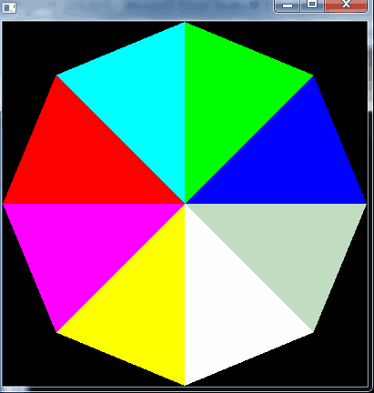
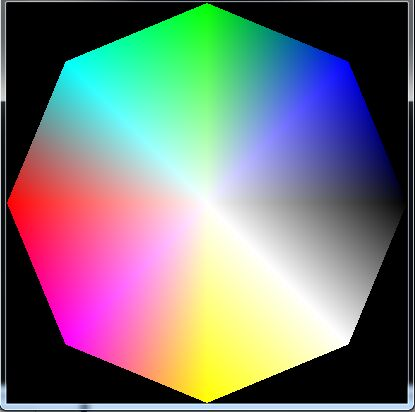
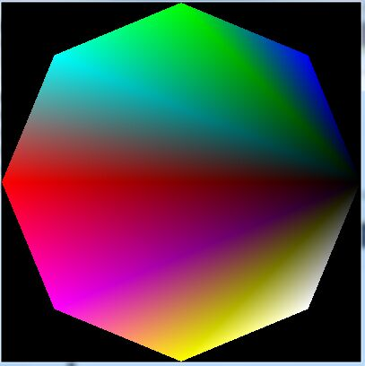
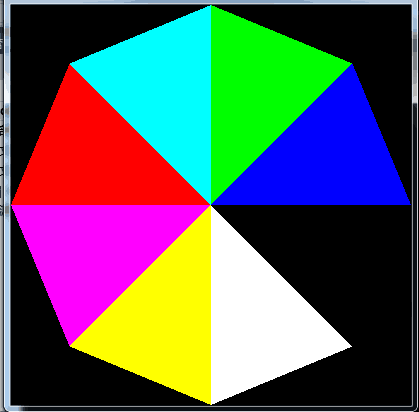

转载/参考自: [OpenGL入门学习](http://www.cnblogs.com/crazyxiaom/articles/2073586.html "OpenGL入门学习")

包括颜色处理、三维变换。

<!--more-->

### OpenGL入门学习[四]: 颜色处理
OpenGL支持两种颜色模式：一种是RGBA，一种是颜色索引模式。
无论哪种颜色模式，计算机都必须为每一个像素保存一些数据。不同的是，RGBA模式中，数据直接就代表了颜色；而颜色索引模式中，数据代表的是一个索引，要得到真正的颜色，还必须去查索引表。
#### RGBA颜色
RGBA模式中，每一个像素会保存以下数据：R值（红色分量）、G值（绿色分量）、B值（蓝色分量）和A值（alpha分量）。其中红、绿、蓝三种颜色相组合，就可以得到我们所需要的各种颜色，而alpha不直接影响颜色，它将留待以后介绍。
在RGBA模式下选择颜色是十分简单的事情，只需要一个函数就可以搞定。
<font color="red">glColor* </font> 系列函数可以用于设置颜色，其中三个参数的版本可以指定R、G、B的值，而A值采用默认；四个参数的版本可以分别指定R、G、B、A的值。如:
```cpp
void glColor3f(GLfloat red, GLfloat green, GLfloat blue);
void glColor4f(GLfloat red, GLfloat green, GLfloat blue, GLfloat alpha);
```
将浮点数作为参数，其中0.0表示不使用该种颜色，而1.0表示将该种颜色用到最多。例如：
```cpp
glColor3f(1.0f, 0.0f, 0.0f);  // 表示不使用绿、蓝色，而将红色使用最多，于是得到最纯净的红色。
glColor3f(0.0f, 1.0f, 1.0f);  // 表示使用绿、蓝色到最多，而不使用红色。混合的效果就是浅蓝色。
glColor3f(0.5f, 0.5f, 0.5f);  // 表示各种颜色使用一半，效果为灰色。
```
Note：浮点数可以精确到小数点后若干位，这并不表示计算机就可以显示如此多种颜色。实际上，计算机可以显示的颜色种数将由硬件决定。如果OpenGL找不到精确的颜色，会进行类似“四舍五入”的处理。

大家可以通过改变下面代码中glColor3f的参数值，绘制不同颜色的矩形。
```cpp
void myDisplay(void)
{
     glClear(GL_COLOR_BUFFER_BIT);
     glColor3f(0.0f, 1.0f, 1.0f);
     glRectf(-0.5f, -0.5f, 0.5f, 0.5f);
     glFlush();
}
```
注意：glColor系列函数，在参数类型不同时，表示“最大”颜色的值也不同。
* 采用f和d做后缀的函数，以1.0表示最大的使用。
* 采用b做后缀的函数，以127表示最大的使用。
* 采用ub做后缀的函数，以255表示最大的使用。
* 采用s做后缀的函数，以32767表示最大的使用。
* 采用us做后缀的函数，以65535表示最大的使用。
这些规则看似麻烦，但熟悉后实际使用中不会有什么障碍。

#### 索引颜色
在索引颜色模式中，OpenGL需要一个颜色表。这个表就相当于画家的调色板：虽然可以调出很多种颜色，但同时存在于调色板上的颜色种数将不会超过调色板的格数。试将颜色表的每一项想象成调色板上的一个格子：它保存了一种颜色。
在使用索引颜色模式画图时，我说“我把第i种颜色设置为某某”，其实就相当于将调色板的第i格调为某某颜色。“我需要第k种颜色来画图”，那么就用画笔去蘸一下第k格调色板。
颜色表的大小是很有限的，一般在256~4096之间，且总是2的整数次幂。在使用索引颜色方式进行绘图时，总是先设置颜色表，然后选择颜色。

##### 选择颜色
使用<font color="red">glIndex* </font>系列函数可以在颜色表中选择颜色。其中最常用的可能是*glIndexi*，它的参数是一个整形。
```cpp
void glIndexi(GLint c);
```

##### 设置颜色表
OpenGL 并直接没有提供设置颜色表的方法，因此设置颜色表需要使用操作系统的支持。我们所用的Windows和其他大多数图形操作系统都具有这个功能，但所使用的函数却不相同。正如我没有讲述如何自己写代码在Windows下建立一个窗口，这里我也不会讲述如何在Windows下设置颜色表。
GLUT工具包提供了设置颜色表的函数glutSetColor，但我测试始终有问题。现在为了让大家体验一下索引颜色，我向大家介绍另一个OpenGL工具包： aux。这个工具包是VisualStudio自带的，不必另外安装(这里用的Visual Studio 2010，没有glaux.h文件，自己网上下即可)，但它已经过时，这里仅仅是体验一下，大家不必深入。
```cpp
#include <windows.h>
#include <GL/gl.h>
#include <GL/glaux.h>
#pragma comment (lib, "opengl32.lib")
#pragma comment (lib, "glaux.lib")
#include <math.h>
const GLdouble Pi = 3.1415926536;
void myDisplay(void)
{
     int i;
     for(i=0; i<8; ++i)
         auxSetOneColor(i, (float)(i&0x04), (float)(i&0x02), (float)(i&0x01));
     glShadeModel(GL_FLAT);
     glClear(GL_COLOR_BUFFER_BIT);
     glBegin(GL_TRIANGLE_FAN);
     glVertex2f(0.0f, 0.0f);
     for(i=0; i<=8; ++i)
     {
         glIndexi(i);
         glVertex2f(cos(i*Pi/4), sin(i*Pi/4));
     }
     glEnd();
     glFlush();
}
int main(void)
{
     auxInitDisplayMode(AUX_SINGLE|AUX_INDEX);
     auxInitPosition(0, 0, 400, 400);
     auxInitWindow(L"");
     myDisplay();
     Sleep(10 * 1000);
     return 0;
}
```
其它部分大家都可以不管，只看myDisplay函数就可以了。首先，使用auxSetOneColor设置颜色表中的一格。循环八次就可以设置八格。
glShadeModel等下再讲，这里不提。
然后在循环中用glVertex设置顶点，同时用glIndexi改变顶点代表的颜色。
最终得到的效果是八个相同形状、不同颜色的三角形，如下图所示。
<center></center>
</br>
索引颜色的主要优势是占用空间小（每个像素不必单独保存自己的颜色，只用很少的二进制位就可以代表其颜色在颜色表中的位置），花费系统资源少，图形运算速度快，但它编程稍稍显得不是那么方便，并且画面效果也会比RGB颜色差一些。“星际争霸”可能代表了256色的颜色表的画面效果，虽然它在一台很烂的PC上也可以运行很流畅，但以目前的眼光来看，其画面效果就显得不足了。
**目前的PC机性能已经足够在各种场合下使用RGB颜色，因此PC程序开发中，使用索引颜色已经不是主流。当然，一些小型设备例如GBA、手机等，索引颜色还是有它的用武之地。**

##### 指定清除屏幕用的颜色
我们写：glClear(GL_COLOR_BUFFER_BIT);意思是把屏幕上的颜色清空。
但实际上什么才叫“空”呢？在宇宙中，黑色代表了“空”；在一张白纸上，白色代表了“空”；在信封上，信封的颜色才是“空”。
OpenGL用下面的函数来定义清楚屏幕后屏幕所拥有的颜色。
在RGB模式下，使用glClearColor来指定“空”的颜色，它需要四个参数，其参数的意义跟glColor4f相似。
在索引颜色模式下，使用glClearIndex来指定“空”的颜色所在的索引，它需要一个参数，其意义跟glIndexi相似。一般在初始化里设置。
```cpp
void myDisplay(void)
{
     glClearColor(1.0f, 0.0f, 0.0f, 0.0f);
     glClear(GL_COLOR_BUFFER_BIT);
     glFlush();
}
```

#### 指定着色模型
OpenGL允许为同一多边形的不同顶点指定不同的颜色。例如：
```cpp
#include <math.h>
const GLdouble Pi = 3.1415926536;
void myDisplay(void)
{
     int i;
     // glShadeModel(GL_FLAT);
     glClear(GL_COLOR_BUFFER_BIT);
     glBegin(GL_TRIANGLE_FAN);
     glColor3f(1.0f, 1.0f, 1.0f);
     glVertex2f(0.0f, 0.0f);
     for(i=0; i<=8; ++i)
     {
         glColor3f(i&0x04, i&0x02, i&0x01);
         glVertex2f(cos(i*Pi/4), sin(i*Pi/4));
     }
     glEnd();
     glFlush();
}
```
<center></center>
</br>
将下列代码删去后的效果如图。
```cpp
     glColor3f(1.0f, 1.0f, 1.0f);
     glVertex2f(0.0f, 0.0f);
```
<center></center>
</br>

在默认情况下，OpenGL会计算两点顶点之间的其它点，并为它们填上“合适”的颜色，使相邻的点的颜色值都比较接近。如果使用的是RGB模式，看起来就具有渐变的效果。如果是使用颜色索引模式，则其相邻点的索引值是接近的，如果将颜色表中接近的项设置成接近的颜色，则看起来也是渐变的效果。但如果颜色表中接近的项颜色却差距很大，则看起来可能是很奇怪的效果。
使用*glShadeModel()*函数可以关闭这种计算，如果顶点的颜色不同，则将顶点之间的其它点全部设置为与某一个点相同。（直线以后指定的点的颜色为准，而多边形将以任意顶点的颜色为准，由实现决定。）为了避免这个不确定性，尽量在多边形中使用同一种颜色。
glShadeModel的使用方法：
```cpp
glShadeModel(GL_SMOOTH);    // 平滑方式，这也是默认方式
glShadeModel(GL_FLAT);      // 单色方式
```
上面例子使用GL_FLAT方式获得的图案如下图:
<center></center>
</br>

### OpenGL入门学习[五] 三维变换

在前面绘制几何图形的时候，大家是否觉得我们绘图的范围太狭隘了呢？坐标只能从-1到1，还只能是X轴向右，Y轴向上，Z轴垂直屏幕。这些限制给我们的绘图带来了很多不便。

我们生活在一个三维的世界——如果要观察一个物体，我们可以：
1. 从不同的位置去观察它。（视图变换）
2. 移动或者旋转它，当然了，如果它只是计算机里面的物体，我们还可以放大或缩小它。（模型变换）
3. 如果把物体画下来，我们可以选择：是否需要一种“近大远小”的透视效果。另外，我们可能只希望看到物体的一部分，而不是全部（剪裁）。（投影变换）
4. 我们可能希望把整个看到的图形画下来，但它只占据纸张的一部分，而不是全部。（视口变换）
这些，都可以在OpenGL中实现。

OpenGL变换实际上是通过矩阵乘法来实现。无论是移动、旋转还是缩放大小，都是通过在当前矩阵的基础上乘以一个新的矩阵来达到目的。
OpenGL可以在最底层直接操作矩阵，不过作为初学，这样做的意义并不大。这里就不做介绍了。

#### 模型变换和视图变换
从“相对移动”的观点来看，改变观察点的位置与方向和改变物体本身的位置与方向具有等效性。在OpenGL中，实现这两种功能甚至使用的是同样的函数。
由于模型和视图的变换都通过矩阵运算来实现，在进行变换前，应先设置当前操作的矩阵为“模型视图矩阵”。设置的方法是以GL_MODELVIEW为参数调用glMatrixMode函数，像这样：
```cpp
glMatrixMode(GL_MODELVIEW);
```
通常，我们需要在进行变换前把当前矩阵设置为单位矩阵。这也只需要一行代码：
```cpp
glLoadIdentity();
```
然后，就可以进行模型变换和视图变换了。进行模型和视图变换，主要涉及到三个函数：
* <font color="red">glTranslate* </font>，把当前矩阵和一个表示移动物体的矩阵相乘。三个参数分别表示了在三个坐标上的位移值。
* <font color="red">glRotate* </font>，把当前矩阵和一个表示旋转物体的矩阵相乘。物体将绕着(0,0,0)到(x,y,z)的直线以逆时针旋转，参数angle表示旋转的角度。如 
```cpp
glRotatef(GLfloat angle,GLfloat x,GLfloat y,GLfloat z);
```
* <font color="red">glScale* </font>，把当前矩阵和一个表示缩放物体的矩阵相乘。x,y,z分别表示在该方向上的缩放比例。

假设当前矩阵为单位矩阵，然后先乘以一个表示旋转的矩阵R，再乘以一个表示移动的矩阵T，最后得到的矩阵再乘上每一个顶点的坐标矩阵v。所以，经过变换得到的顶点坐标就是((RT)v)。由于矩阵乘法的结合率，((RT)v) = (R(Tv))，换句话说，实际上是先进行移动，然后进行旋转。即：实际变换的顺序与代码中写的顺序是相反的。由于“先移动后旋转”和“先旋转后移动”得到的结果很可能不同。
OpenGL之所以这样设计，是为了得到更高的效率。但在绘制复杂的三维图形时，如果每次都去考虑如何把变换倒过来，也是很痛苦的事情。这里介绍另一种思路，可以让代码看起来更自然（写出的代码其实完全一样，只是考虑问题时用的方法不同了）。
让我们想象，坐标并不是固定不变的。旋转的时候，坐标系统随着物体旋转。移动的时候，坐标系统随着物体移动。如此一来，就不需要考虑代码的顺序反转的问题了。

以上都是针对改变物体的位置和方向来介绍的。如果要改变观察点的位置，除了配合使用glRotate* 和glTranslate* 函数以外，还可以使用这个函数：<font color="red"> gluLookAt </font>。它的参数比较多，前三个参数表示了观察点的位置，中间三个参数表示了观察目标的位置，最后三个参数代表从(0,0,0)到 (x,y,z)的直线，它表示了观察者认为的“上”方向。

#### 投影变换
投影变换就是定义一个可视空间，可视空间以外的物体不会被绘制到屏幕上。（注意，从现在起，坐标可以不再是-1.0到1.0了）
OpenGL支持两种类型的投影变换，即透视投影和正投影。投影也是使用矩阵来实现的。如果需要操作投影矩阵，需要以GL_PROJECTION为参数调用glMatrixMode函数。
```cpp
glMatrixMode(GL_PROJECTION);
```
通常，我们需要在进行变换前把当前矩阵设置为单位矩阵。
```cpp
glLoadIdentity();
```
透视投影所产生的结果类似于照片，有近大远小的效果，比如在火车头内向前照一个铁轨的照片，两条铁轨似乎在远处相交了。
使用 *glFrustum函数* 可以将当前的可视空间设置为透视投影空间。

正投影相当于在无限远处观察得到的结果，它只是一种理想状态。但对于计算机来说，使用正投影有可能获得更好的运行速度。
使用 *glOrtho函数* 可以将当前的可视空间设置为正投影空间。

如果绘制的图形空间本身就是二维的，可以使用gluOrtho2D。他的使用类似于glOrgho。

#### 视口变换
当一切工作已经就绪，只需要把像素绘制到屏幕上了。这时候还剩最后一个问题：应该把像素绘制到窗口的哪个区域呢？通常情况下，默认是完整的填充整个窗口，但我们完全可以只填充一半。（即：把整个图象填充到一半的窗口内）
使用 *glViewport* 来定义视口。其中前两个参数定义了视口的左下脚（0,0表示最左下方），后两个参数分别是宽度和高度。

#### 操作矩阵堆栈
我们在进行矩阵操作时，有可能需要先保存某个矩阵，过一段时间再恢复它。当我们需要保存时，调用 *glPushMatrix函数* ，它相当于把矩阵（相当于盘子）放到堆栈上。当需要恢复最近一次的保存时，调用 *glPopMatrix函数* ，它相当于把矩阵从堆栈上取下。OpenGL规定堆栈的容量至少可以容纳32个矩阵，某些OpenGL实现中，堆栈的容量实际上超过了32个。因此**不必过于担心矩阵的容量问题**。
**通常，用这种先保存后恢复的措施，比先变换再逆变换要更方便，更快速。**
注意：模型视图矩阵和投影矩阵都有相应的堆栈。使用glMatrixMode来指定当前操作的究竟是模型视图矩阵还是投影矩阵。

#### 综合举例
我们要制作的是一个三维场景，包括了太阳、地球和月亮。假定一年有12个月，每个月30天。每年，地球绕着太阳转一圈。每个月，月亮围着地球转一圈。即一年有360天。现在给出日期的编号（0~359），要求绘制出太阳、地球、月亮的相对位置示意图。（这是为了编程方便才这样设计的。如果需要制作更现实的情况，那也只是一些数值处理而已，与OpenGL关系不大）
首先，让我们认定这三个天体都是球形，且他们的运动轨迹处于同一水平面，建立以下坐标系：太阳的中心为原点，天体轨迹所在的平面表示了X轴与Y轴决定的平面，且每年第一天，地球在X轴正方向上，月亮在地球的正X轴方向。

下一步是确立可视空间。注意：太阳的半径要比太阳到地球的距离短得多。如果我们直接使用天文观测得到的长度比例，则当整个窗口表示地球轨道大小时，太阳的大小将被忽略。因此，我们只能成倍的放大几个天体的半径，以适应我们观察的需要。（百度一下，得到太阳、地球、月亮的大致半径分别是：696000km， 6378km，1738km。地球到太阳的距离约为1.5亿km=150000000km，月亮到地球的距离约为380000km。）
让我们假想一些数据，将三个天体的半径分别“修改”为：69600000（放大100倍），15945000（放大2500倍），4345000（放大5000倍）。将地球到月亮的距离“修改”为38000000（放大100倍）。地球到太阳的距离保持不变。
为了让地球和月亮在离我们很近时，我们仍然不需要**变换观察点和观察方向**就可以观察它们，我们把观察点放在这个位置：(0, -200000000, 0) ——因为地球轨道半径为150000000，咱们就凑个整，取-200000000就可以了。观察目标设置为原点（即太阳中心），选择Z轴正方向作为“上”方。当然我们还可以把观察点往“上”方移动一些，得到(0, -200000000, 200000000)，这样可以得到45度角的俯视效果。
为了得到透视效果，我们使用 *gluPerspective* 来**设置可视空间**。假定可视角为60度（如果调试时发现该角度不合适，可修改之。我在最后选择的数值是75。），高宽比为1.0。最近可视距离为1.0，最远可视距离为 200000000 * 2=400000000。即：
```cpp
gluPerspective (60, 1, 1, 400000000);
```
现在我们来看看如何绘制这三个天体。
为了简单起见，我们把三个天体都想象成规则的球体。而我们所使用的glut实用工具中，正好就有一个绘制球体的现成函数：*glutSolidSphere*，这个函数在“原点”绘制出一个球体。由于坐标是可以通过 glTranslate* 和glRotate* 两个函数进行随意变换的，所以我们就可以在任意位置绘制球体了。函数有三个参数：第一个参数表示球体的半径，后两个参数代表了“面”的数目，简单点说就是球体的精确程度，数值越大越精确，当然代价就是速度越缓慢。这里我们只是简单的设置后两个参数为20。
太阳在坐标原点，所以不需要经过任何变换，直接绘制就可以了。
地球则要复杂一点，需要变换坐标。由于今年已经经过的天数已知为day，则地球转过的角度为 **day/ 一年的天数* 360度**。前面已经假定每年都是360天，因此地球转过的角度恰好为day。所以可以通过下面的代码来解决：
```cpp
glRotatef(day, 0, 0, -1);
/* 注意地球公转是“自西向东”的，因此是饶着Z轴负方向进行逆时针旋转 */
glTranslatef(地球轨道半径, 0, 0);
glutSolidSphere(地球半径, 20, 20);
```
月亮是最复杂的。因为它不仅要绕地球转，还要随着地球绕太阳转。但如果我们选择地球作为参考，则月亮进行的运动就是一个简单的圆周运动了。如果我们先绘制地球，再绘制月亮，则只需要进行与地球类似的变换：
```cpp
glRotatef(月亮旋转的角度, 0, 0, -1);
glTranslatef(月亮轨道半径, 0, 0);
glutSolidSphere(月亮半径, 20, 20);
```
但这个“月亮旋转的角度”，并不能简单的理解为 day/一个月的天数30 *360度 。因为我们在绘制地球时，这个坐标已经是旋转过的。现在的旋转是在以前的基础上进行旋转，因此还需要处理这个“差值”。我们可以写成：day/30 *360 - day，即减去原来已经转过的角度。这只是一种简单的处理，当然**也可以在绘制地球前用glPushMatrix保存矩阵，绘制地球后用glPopMatrix恢复矩阵。再设计一个跟地球位置无关的月亮位置公式，来绘制月亮**。通常后一种方法比前一种要好，因为浮点的运算是不精确的，即是说我们计算地球本身的位置就是不精确的。拿这个不精确的数去计算月亮的位置，会导致 “不精确”的**成分累积**，过多的“不精确”会造成错误。我们这个小程序没有去考虑这个，但并不是说这个问题不重要。
还有一个需要注意的细节： OpenGL把三维坐标中的物体绘制到二维屏幕，绘制的顺序是按照代码的顺序来进行的。因此**后绘制的物体会遮住先绘制的物体**，即使后绘制的物体在先绘制的物体的“后面”也是如此。**使用深度测试可以解决这一问题**。使用的方法是：
1、以GL_DEPTH_TEST为参数调用glEnable函数，启动深度测试。
2、在必要时(通常是每次绘制画面开始时)清空深度缓冲，即：
```cpp
glClear(GL_DEPTH_BUFFER_BIT);
```
其中，glClear (GL_COLOR_BUFFER_BIT)与glClear(GL_DEPTH_BUFFER_BIT)可以合并写为：
```cpp
glClear(GL_COLOR_BUFFER_BIT | GL_DEPTH_BUFFER_BIT);
```
且后者的运行速度可能比前者快。

到此为止，我们终于可以得到整个“太阳，地球和月亮”系统的完整代码。

```cpp
// 太阳、地球和月亮
// 假设每个月都是30天
// 一年12个月，共是360天
static int day = 200; // day的变化：从0到359
void myDisplay(void)
{
     glEnable(GL_DEPTH_TEST); //深度测试
     glClear(GL_COLOR_BUFFER_BIT | GL_DEPTH_BUFFER_BIT);
     glMatrixMode(GL_PROJECTION); // 投影变化
     glLoadIdentity();
     gluPerspective(75, 1, 1, 400000000); // 设置可视空间
     glMatrixMode(GL_MODELVIEW); // 模型变化 进行旋转等变换前应先设置
     glLoadIdentity();
     // 观察点的位置&观察目标的位置&“上”方向
     gluLookAt(0, -200000000, 200000000, 0, 0, 0, 0, 0, 1); 
     // 绘制红色的“太阳”
     glColor3f(1.0f, 0.0f, 0.0f);
     glutSolidSphere(69600000, 20, 20);
     // 绘制蓝色的“地球”
     glColor3f(0.0f, 0.0f, 1.0f);
     glRotatef(day / 360.0 * 360.0, 0.0f, 0.0f, -1.0f);
     glTranslatef(150000000, 0.0f, 0.0f);
     glutSolidSphere(15945000, 20, 20);
     // 绘制黄色的“月亮”
     glColor3f(1.0f, 1.0f, 0.0f);
     glRotatef(day/30.0 * 360.0 - day/360.0*360.0, 0.0f, 0.0f, -1.0f);
     glTranslatef(38000000, 0.0f, 0.0f);
     glutSolidSphere(4345000, 20, 20);
     glFlush();
}
```

修改day的值，看看画面有何变化。

小结：
OpenGL通过矩阵变换来把三维物体转变为二维图象，进而在屏幕上显示出来。为了指定当前操作的是何种矩阵，我们使用了函数glMatrixMode。
我们可以移动、旋转观察点或者移动、旋转物体，使用的函数是 glTranslate* 和 glRotate* 。
我们可以缩放物体，使用的函数是 glScale* 。
我们可以定义可视空间，这个空间可以是“正投影”的（使用glOrtho或gluOrtho2D），也可以是“透视投影”的（使用glFrustum或gluPerspective）。
我们可以定义绘制到窗口的范围，使用的函数是glViewport。
矩阵有自己的“堆栈”，方便进行保存和恢复。这在绘制复杂图形时很有帮助。使用的函数是glPushMatrix和glPopMatrix。

