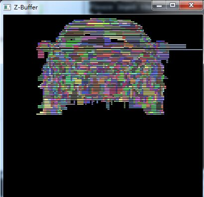
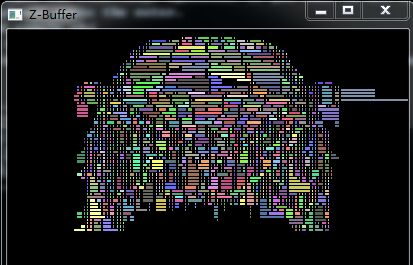
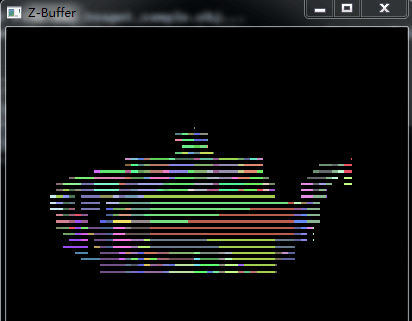
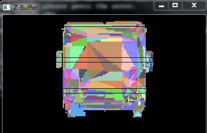

最近几篇文章的链接和效果图的呈现。没有写z扫描线算法的实现，源代码里有一定的说明。这里提一下特殊处理的情况: 
在坐标系中与xOy面平行的面的处理 -> 是跳过没有处理，就看成线太细看不清了。
与xOy平行的线的处理

<!--more-->

#### 文章和源代码的链接

<a href="http://ycymio.com/blog/2016/03/20/OpenGL-beginner-1/" title="OpenGL入门学习系列集(一)" target="_blank" rel="external" class="link">OpenGL入门学习系列集(一)</a>

<a href="http://ycymio.com/blog/2016/03/21/OpenGL-beginner-2/" title="OpenGL入门学习系列集(二)" target="_blank" rel="external" class="link">OpenGL入门学习系列集(二)</a>

<a href="http://ycymio.com/blog/2016/03/24/OpenGL-beginner-3/" title="OpenGL入门学习系列集(三)" target="_blank" rel="external" class="link">OpenGL入门学习系列集(三)</a>

<a href="http://ycymio.com/blog/2016/03/18/OpenGL-obj/" title="obj文件格式简述" target="_blank" rel="external" class="link">obj文件格式简述</a>

<a href="https://github.com/ycymio/z-buffer-scan-line" title="Z扫描线算法的实现" target="_blank" rel="external" class="link">Z扫描线算法的实现</a>

#### 一千面片以上的处理效果图

3dsMax自带的ford: （它的呈现有bug，但没找到...面片印象中上万了）

面片横向间也有间隙版：

3dsMax自带的teapot: 

3dsMax自带的camper: 

