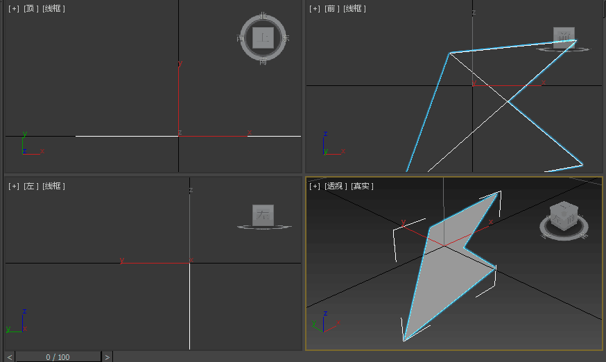

转载/参考自: [3D中的OBJ文件格式详解](http://www.cppblog.com/lovedday/archive/2008/06/13/53153.html "3D中的OBJ文件格式详解")

OBJ文件是Alias|Wavefront公司为它的一套基于工作站的3D建模和动画软件"Advanced Visualizer"开发的一种标准3D模型文件格式，很适合用于3D软件模型之间的互导，也可以通过Maya读写。比如你在3dsMax或LightWave中建了一个模型，想把它调到Maya里面渲染或动画，导出OBJ文件就是一种很好的选择。目前几乎所有知名的3D软件都支持OBJ文件的读写，不过其中很多需要通过插件才能实现。
OBJ文件是一种文本文件，可以直接用写字板打开进行查看和编辑修改。另外，有一种与此相关二进制文件格式(*.MOD)，其作为专利未公开，因此这里不作讨论。
这里OBJ文件针对3dsMax分析。
<!--more-->
#### OBJ文件的特点
OBJ3.0文件格式支持直线(Line)、多边形(Polygon)、表面(Surface)和自由形态曲线(Free-form Curve)。直线和多角形通过它们的点来描述，曲线和表面则根据它们的控制点和依附于曲线类型的额外信息来定义，这些信息支持规则和不规则的曲线，包括那些基于贝塞尔曲线(Bezier)、B样条(B-spline)、基数(Cardinal/Catmull-Rom)和泰勒方程(Taylor equations)的曲线。其他特点如下：
(1)OBJ文件是一种3D模型文件。不包含动画、材质特性、贴图路径、动力学、粒子等信息。
(2)OBJ文件主要支持多边形(Polygons)模型。虽然也支持曲线(Curves)、表面(Surfaces)、点组材质(Point Group Materials)，但Maya导出的OBJ文件并不包括这些信息。
(3)OBJ文件支持三个点以上的面，这一点很有用。很多其它的模型文件格式只支持三个点的面，所以导入Maya的模型经常被三角化了，这对于我们对模型进行再加工甚为不利。 
(4)OBJ文件支持法线和贴图坐标。在其它软件中调整好贴图后，贴图坐标信息可以存入OBJ文件中，这样文件导入Maya后只需指定一下贴图文件路径就行了，不需要再调整贴图坐标。

#### OBJ文件的基本结构
OBJ文件不需要任何种文件头(File Header)，尽管经常使用几行文件信息的注释作为文件的开头。OBJ文件由一行行文本组成，注释行以符号“#”为开头，空格和空行可以随意加到文件中以增加文件的可读性。有字的行都由一两个标记字母也就是关键字(Keyword)开头，关键字可以说明这一行是什么样的数据。多行可以逻辑地连接在一起表示一行，方法是在每一行最后添加一个连接符(\)。 注意连接符(\)后面不能出现空格或Tab格，否则将导致文件出错。

下列关键字可以在OBJ文件使用。在这个列表中, 关键字根据数据类型排列，每个关键字有一段简短描述。

顶点数据(Vertex data):
+  v 几何体顶点(Geometric vertices)
+  vt 贴图坐标点(Texture vertices)
+  vn 顶点法线(Vertex normals)
+  vp 参数空格顶点 (Parameter space vertices)

自由形态曲线(Free-form curve)/表面属性(surface attributes):
+    deg 度(Degree)
+   bmat 基础矩阵(Basis matrix)
+   step 步尺寸(Step size)
+ cstype 曲线或表面类型 (Curve or surface type)

元素(Elements):
+     p 点(Point)
+     l 线(Line)
+     f 面(Face)
+  curv 曲线(Curve)
+ curv2 2D曲线(2D curve)
+  surf 表面(Surface)

自由形态曲线(Free-form curve)/表面主体陈述(surface body statements):
+ parm 参数值(Parameter values )
+ trim 外部修剪循环(Outer trimming loop)
+ hole 内部整修循环(Inner trimming loop)
+ scrv 特殊曲线(Special curve)
+   sp 特殊的点(Special point)
+  end 结束陈述(End statement)

自由形态表面之间的连接(Connectivity between free-form surfaces):
+  con 连接 (Connect)

成组(Grouping):
+  g 组名称(Group name)
+  s 光滑组(Smoothing group)
+ mg 合并组(Merging group)
+  o 对象名称(Object name)

显示(Display)/渲染属性(render attributes):
+      bevel 导角插值(Bevel interpolation)
+   c_interp 颜色插值(Color interpolation)
+   d_interp 溶解插值(Dissolve interpolation)
+        lod 细节层次(Level of detail)
+     usemtl 材质名称(Material name)
+     mtllib 材质库(Material library)
+ shadow_obj 投射阴影(Shadow casting)
+  trace_obj 光线跟踪(Ray tracing)
+      ctech 曲线近似技术(Curve approximation technique)
+      stech 表面近似技术 (Surface approximation technique)

#### OBJ文件实例
的确挺难理解，下面通过实例来具体讲解。让我们来创建一个OBJ文件，内容为一个四边形，不过这一回我们不用3D软件，而是用写字板来创建。打开写字板，把下面的5行代码写入，可以适当加一点注释。保存文件为文本格式，文件名为"myObj.obj"。
>v -0.58 0.84 0
v 2.68 1.17 0
v 2.84 -2.03 0
v -1.92 -2.89 0
f 1 2 3 4

注意：代码最后一定要按一下回车把光标切换到下一行，就是说加一个换行符(\n)。否则会看到如下错误信息：
// Error: line 1: OBJ file line 5: index out of range. //
// Error: line 1: Error reading file. //
在3dsMax中导入"myObj.obj"文件，看见了吧，导入了一个四边形。这个四边形的形状是完全由前面的那5行代码决定的。

 

我们来分析一下这些代码。
> v -0.58 0.84 0

画一个四边形需要四个顶点，这是第一个顶点，"v"表示顶点(vertex)，"-0.58"为这个顶点的X轴坐标值，"0.84"为Y轴坐标值，"0"为Z轴坐标值。它的索引号是1。索引号是画面时要用到的。

>v 2.68 1.17 0
v 2.84 -2.03 0
v -1.92 -2.89 0

这分别是第二、三、四个顶点，它们的索引号分别是2，3，4。

> f 1 2 3 4

现在开始画面，"f"表示面(face)，1，2，3，4是前面那四个顶点的索引号。请注意画这个面连接点的顺序，是从第一个点出发，依次连接第二、三、四个点。
如果连接的顺序不同所生成的面也会截然不同，例如"f 1 2 4 3"会产生一个交迭的面，如下图。

 

面的连接点是按顺时针排列或逆时针排列，将决定面的法线方向(面的反正)。例如："f 1 2 3 4"面的法线向外，"f 4 3 2 1"面的法线向里。 面的连接点顺序错误，是导致导入模型产生碎面的一个重要原因。
一个面不能出现两个以上相同的顶点，这也是检查OBJ文件出错的一个要点。例如："f 1 2 3 4 3"，有两个相同的顶点，索引号是3。一个面出现两个相同顶点，可能造成程序的内存分配错误。

再次从3dsMax中导出obj文件，文件内容为：
>\# 3ds Max Wavefront OBJ Exporter v0.97b - (c)2007 guruware
\# 创建的文件:18.03.2016 17:07:16
\#
\# object default
\#
v  -0.5800 0.0000 0.8400
v  2.6800 0.0000 1.1700
v  2.8400 0.0000 -2.0300
v  -1.9200 0.0000 -2.890/
\# 4 vertices
g default
f 1 2 3 4/
\# 1 polygons

下面来研究一下3dsMax导出的OBJ文件。
在3dsMax中创建一个四边形立方体，导出格式为OBJ，文件名为"test1.obj"。对应图片如下:

 

导出前，纹理坐标、光滑组等都可以选择，如下图所示:

 

用记事本打开"test1.obj"，可以看到如下代码：

>\# 3ds Max Wavefront OBJ Exporter v0.97b - (c)2007 guruware
\# 创建的文件:14.03.2016 15:53:55
\#
\# object Box001
\#
v  -26.9549 0.0000 49.2526
v  -26.9549 0.0000 -23.4603
v  -3.8191 0.0000 -23.4603
v  -3.8191 0.0000 49.2526
v  -26.9549 20.5754 49.2526
v  -3.8191 20.5754 49.2526
v  -3.8191 20.5754 -23.4603
v  -26.9549 20.5754 -23.4603
\# 8 vertices
vn 0.0000 -1.0000 -0.0000
vn 0.0000 1.0000 -0.0000
vn 0.0000 0.0000 1.0000
vn 1.0000 0.0000 -0.0000
vn 0.0000 0.0000 -1.0000
vn -1.0000 0.0000 -0.0000
\# 6 vertex normals
g Box001
s 2
f 1//1 2//1 3//1 4//1 
s 4
f 5//2 6//2 7//2 8//2 
s 8
f 1//3 4//3 6//3 5//3 
s 16
f 4//4 3//4 7//4 6//4 
s 32
f 3//5 2//5 8//5 7//5 
s 64
f 2//6 1//6 5//6 8//6 
\# 6 polygons
这个文件看起来稍复杂一些，用到了许多关键词，可以对照前面的列表查看一下每个关键词的意思：
"v  -26.9549 0.0000 49.2526" --> v: 几何体顶点坐标
"vn 0.0000 -1.0000 -0.0000" --> vn: 顶点的法线。如果不勾选"法线", 则无该数据。
"s 2" --> s: 光滑组(给不同的面指定不同的平滑或不平滑)。数值是何解，这里未研究。如果不勾选“平滑组”，则无该行。之前见转载博客写Maya生成obj时会标注 "s off", 3dsMax并没有。
"f 1//1 2//1 3//1 4//1" --> f: 面(Face)。格式是"f 顶点索引/贴图坐标uv点索引/法线索引"。如果不勾选"法线", 则后一个"/"及其以后数组不会显示。
"g Box001" -->  g: 组名称.这里的成组与Maya中的成组不一样，这里的成组是指把"g Box001"后出现的面都结合到一起，组成一个整的多边形几何体。

把"test1.obj"文件修改一下就知道成组的意思了。把"g Box001"这句以及后面的代码替换成以下代码：
>g Box001
s 2
f 1//1 2//1 3//1 4//1
g Box002 
s 4
f 5//2 6//2 7//2 8//2 
g Box003
s 8
f 3//3 5//3 8//3 4//3 
g Box004
s 16
f 2//4 6//4 5//4 3//4 
g Box005
s 32
f 1//5 7//5 6//5 2//5 
g Box006
s 64
f 4//6 8//6 7//6 1//6 
\# 6 polygons

导入3dsMax时如下图显示，可选择导入哪些组:

 

导入后可以看到，立方体的每个面是分离的。

 

Note:
这里未涉及的几个方面:
1. "vt 1.000000 0.000000" --> "vt": 点的贴图坐标。
贴图坐标是提供给需要纹理材质的物体对象的，所有可渲染的对象本身已经是自动生成贴图坐标的，如果物体对象只是单一的颜色没有纹理，则不需要修改它的贴图坐标，如果要给它赋予纹理，则需要注意他的贴图坐标，贴图坐标和三维对象一样有3个坐标轴，UVW分别对应XYZ，其中W只准许对象重叠而没有实际距离参数所以大多数称贴图坐标为UV，我说得形象一点，UV就像一个纸质包装盒，我们看到的盒子是立体的，但是实际上做这个盒子时他是一块硬纸，我们要做得，就像是把一个包装盒子强行的重新拆开成一个不规则硬纸张，再打印上自己需要的图案然后折成包装和，这样就完成了盒子的图案贴图。
2. "usemtl default" --> 选择导出材质后会出现该行设定，表示使用的材质。
3. 据说组名称等地方是不能用中文命名的，据说OBJ文件不支持有空的多边形面，这里未做尝试。

#### OBJ文件的实际问题：
现在来讨论一点比较实际的问题吧，就是一旦你遇到了一个出错的OBJ文件，倒底该怎么办？
当你打开OBJ文件后，往往会看到有几万行的代码，你恐怕还没本事情一眼看出错误所在行，除非程序的错误信息中已经告诉你错误行。如果你不知道错误在哪里，可以用排除法，弄清楚肯定正确的代码范围，通过缩减错误代码范围定位错误。例如，你先新建一个空的OBJ文件，把有错的OBJ文件代码粘贴一半过来，然后把这个只有一半代码的新OBJ文件导入Maya。如果这时没有错误信息，说明错误行是在另一半代码中，可以从另一半代码中再粘贴一部分代码试试看；如果这时出现错误，说明错误行就在粘贴的代码中，可以把粘贴过来的代码删去一部分再试试看。就这样，逐步缩减范围直到找到错误行为止。
这种方法虽然很麻烦，不过颇为有效。如果你不会编程，又遇到非常紧急的情况，这种方法还是值得一试的。

####OBJ文件的更多细节：

简单的OBJ格式写法。
>\# Simple Wavefront file
v 0.0 0.0 0.0
v 0.0 1.0 0.0
v 1.0 0.0 0.0
f 1 2 3

面可以使用负值索引，有时用负值索引描述面更为简便。
>v -0.500000 0.000000 0.400000
v -0.500000 0.000000 -0.800000
v -0.500000 1.000000 -0.800000
v -0.500000 1.000000 0.400000
f -4 -3 -2 -1

"f -4 -3 -2 -1"这句索引值"-3"表示从"f"这行往上数第3个顶点，就是"v -0.500000 0.000000 -0.800000"，其它的索引值以此类推。 因此与这一行等效的正值索引写法为："f 1 2 3 4"

OBJ文件不包含面的颜色定义信息，不过可以引用材质库，材质库信息储存在一个后缀是".mtl"的独立文件中。关键字"mtllib"即材质库的意思。材质库中包含材质的漫射(diffuse)，环境(ambient)，光泽(specular)的RGB(红绿蓝)的定义值，以及反射(specularity)，折射(refraction)，透明度(transparency)等其它特征。"usemtl"指定了材质之后，以后的面都是使用这一材质，直到遇到下一个"usemtl"来指定新的材质。

指定材质的方法： Cube with Materials：
>\# This cube has a different material
\# applied to each of its faces.
mtllib master.mtl
v 0.000000 2.000000 2.000000
v 0.000000 0.000000 2.000000
v 2.000000 0.000000 2.000000
v 2.000000 2.000000 2.000000
v 0.000000 2.000000 0.000000
v 0.000000 0.000000 0.000000
v 2.000000 0.000000 0.000000
v 2.000000 2.000000 0.000000
\# 8 vertices
g front
usemtl red
f 1 2 3 4
g back
usemtl blue
f 8 7 6 5
g right
usemtl green
f 4 3 7 8
g top
usemtl gold
f 5 1 4 8
g left
usemtl orange
f 5 6 2 1
g bottom
usemtl purple
f 2 6 7 3
\# 6 elements

贝塞尔片面(Bezier Patch)：
\# 3.0 Bezier patch
v -5.000000 -5.000000 0.000000
v -5.000000 -1.666667 0.000000
v -5.000000 1.666667 0.000000
v -5.000000 5.000000 0.000000
v -1.666667 -5.000000 0.000000
v -1.666667 -1.666667 0.000000
v -1.666667 1.666667 0.000000
v -1.666667 5.000000 0.000000
v 1.666667 -5.000000 0.000000
v 1.666667 -1.666667 0.000000
v 1.666667 1.666667 0.000000
v 1.666667 5.000000 0.000000
v 5.000000 -5.000000 0.000000
v 5.000000 -1.666667 0.000000
v 5.000000 1.666667 0.000000
v 5.000000 5.000000 0.000000
\# 16 vertices
cstype bezier
deg 3 3
\# Example of line continuation
surf 0.000000 1.000000 0.000000 1.000000 13 14 \
15 16 9 10 11 12 5 6 7 8 1 2 3 4
parm u 0.000000 1.000000
parm v 0.000000 1.000000
end 　
\# 1 element

基数曲线(Cardinal Curve)：
\# 3.0 Cardinal curve
v 0.940000 1.340000 0.000000
v -0.670000 0.820000 0.000000
v -0.770000 -0.940000 0.000000
v 1.030000 -1.350000 0.000000
v 3.070000 -1.310000 0.000000
\# 6 vertices
cstype cardinal
deg 3
curv 0.000000 3.000000 1 2 3 4 5 6
parm u 0.000000 1.000000 2.000000 3.000000 end
\# 1 element

3dsMax对以上两种曲线文件都无法导入。