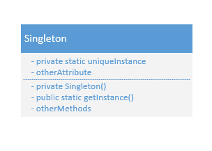

一个数字滤波器只能有一个A/D转换器。一个会计系统只能专用于一个公司，线程池(threadpool)、缓存(cache)、对话框、处理偏好设置、注册表的对象、日志对象等等，其实我们只需要一个。

<!--more-->

<style type="text/css">
p{text-indent: 26px; margin-bottom: 0px;}
ul, ol{margin-top: 0px;}
.posts-expand .post-body img{border:none}
h3{font-size: 18px}
h4{font-size: 16px}
</style>

## 意图
保证一个类仅有一个实例，并提供一个访问它的全局访问点。

## 动机
对一些类来说，只有一个实例是很重要的。虽然系统中可以有许多打印机，但却只应该有一个打印假脱机(printer spooler)，只应该有一个文件系统和一个窗口管理器。一个数字滤波器只能有一个A/D转换器。一个会计系统只能专用于一个公司，线程池(threadpool)、缓存(cache)、对话框、处理偏好设置、注册表的对象、日志对象等等，其实我们只需要一个。

我们怎么样才能保证一个类只有一个实例并且这个实例易于被访问呢？一个全局变量使得一个对象可以被访问，但它不能防止你实例化多个对象。

一个更好的办法是，**让类自身负责保存它的唯一实例。这个类可以保证没有其他实例可以被创建（通过截取创建新对象的请求），并且它可以提供一个访问该实例的方法**。这就是 Singleton 模式。


## 适用性
在下面的情况下可以使用 Singleton 模式: 
- 当类只能有一个实例而且客户可以从一个众所周知的访问点访问它时。
- 当这个唯一实例应该是通过子类化可扩展的，并且客户应该无需更改代码就能使用一个扩展的实例时。

## 结构
<center>  </center>

## 参与者
- Singleton
—— 通常构造方法定义为私有方法。
—— 定义一个 getInstance 操作,允许客户访问它的唯一实例。getInstance是一个类操作(即Java中的一个静态成员函数，一般都命名为getInstance)。
—— 它是负责创建并保持它自己的唯一实例。

## 协作
客户只能通过Singleton的Instance操作访问一个Singleton的实例。

## 效果
Singleton模式有许多优点：
1. 对唯一实例的受控访问 &nbsp;&nbsp;&nbsp;&nbsp; 因为**Singleton类封装它的唯一实例**，所以它可以严格的控制客户怎样以及何时访问它。
2. 缩小命名空间 &nbsp;&nbsp;&nbsp;&nbsp; Singleton模式是对全局变量的一种改进。它避免了那些存储唯一实例的全局变量污染命名空间。
3. 允许对操作和表示的精化 &nbsp;&nbsp;&nbsp;&nbsp; Singleton类可以有子类，而且用这个扩展类的实例来配置一个应用是很容易的。你可以用你所需要的类的实例在运行时刻配置应用。
4. 允许可变数目的实例 &nbsp;&nbsp;&nbsp;&nbsp; 这个模式使得你易于改变你的想法，并允许Singleton类的多个实例。此外，你可以用相同的方法来控制应用所使用的实例的数目。只有允许访问Singleton实例的操作需要改变。
5. 比类操作更灵活 &nbsp;&nbsp;&nbsp;&nbsp; 另一种封装单件功能的方式是使用类操作(即Java中的静态成员函数)。但这两种语言技术都难以改变设计以允许一个类有多个实例。

## 实现
下面是使用Singleton模式时所要考虑的实现问题:

### 保证一个唯一的实例
Singleton模式使得这个唯一实例是类的一般实例，但该类被写成只有一个实例能被创建。做到这一点的一个常用方法是**将创建这个实例的操作隐藏在一个类操作(即一个静态成员函数或者是一个类方法)后面，由它保证只有一个实例被创建**。这个操作可以访问保存唯一实例的变量，而且它可以保证这个变量在返回值之前已经进行了这个唯一实例初始化。这种方法保证了单件在它首次使用前被创建和使用。

在Java中，可以使用Singleton类的静态成员函数getInstance()来定义这个类操作，在该类中还定义了一个静态成员变量instance，保存了该类的唯一实例。

Singleton类定义如下（该种写法即**懒汉式**，**线程不安全**）:

```java
class Singleton {
    // Definition 1
    private static Singleton instance = null;
    private Singleton() {}
    public static Singleton getInstance(){
        if( instance == null){
            instance = new Singleton();
        }
        return instance;
    }
    // 其他方法
}
```

由此可见，客户仅可以通过getInstance成员函数访问这个单件。变量instance初始化为null，而静态成员函数getInstance返回该变量值，如果其值为null则初始化，获得唯一的实例。getInstance使用延迟初始化(lazy loading)，它的返回值直到被第一次访问时才创建和保存，因而又被称为懒汉式。
注意构造器是私有的(《GoF》中更倾向于是protected的，也就是说允许子类调用该方法；《Head first设计模式》倾向于private，各有取舍)。试图直接实例化Singleton的程序将在编译时报错。这就保证了仅有一个实例可以被创建。

也可以通过使用全局或静态的对象，该方法依赖于自动的初始化，它使得所有单件无论使用与否，都被创建，代码如下（该种写法也被称为**饿汉式**）:
```java
class Singleton {
    // Definition 2
    private static Singleton instance = new Singleton();
    private Singleton(){}
    public static Singleton getInstance(){
        return instance;
    }
}
```

在《Java与模式》中，作者提出：“饿汉式单例类可以在Java语言实现，但不易在C++内实现，因为静态初始化在C++里没有固定的顺序，因而静态的instance变量的初始化与类的加载顺序没有保证，可能会出问题。这就是为什么GoF在提出单例类的概念时，举的例子是懒汉式的。他们的书影响之大，以致Java语言中单例类的例子也大多是懒汉式的。实际上，本书认为饿汉式单例类更符合Java语言本身的特点。”

### 创建Singleton类的子类

此时，构造器是protected的。主要问题与其说是定义子类，不如说是建立它的唯一实例，这样客户就可以使用它。事实上，指向单件实例的变量必须用子类的实例进行初始化。最简单的技术是在Singleton的getInstance操作中决定你想使用的是哪一个单件。

另一个选择Singleton的子类的方法是将getInstance的实现从父类中分离出来并将它放入子类。这就允许在链接时刻决定单件的类，但对单件的客户则隐蔽这一点。

链接的方法在链接时刻确定了单件类的选择，这使得难以在运行时刻选择单件类。使用 条件语句来决定子类更加灵活一些，但这硬性限定了所有可能的Singleton类的集合。这两种方法不是在所有的情况都足够灵活的。

一个更灵活的方法是使用一个单件注册表(registry of singleton)。 可能的Singleton类的集合不是由getInstance定义的，Singleton类可以根据名字在一个设定的注册表中注册它们的单件实例。

这个注册表在字符串名字和单件之间建立映射。当getInstance需要一个单件时，它参考注册表，根据名字请求单件。注册表查询相应的单件(如果存在的话)并返回它。这个方法使得getInstance不再需要知道所有可能的Singleton类或实例。它所需要的只是所有Singleton类的一个公共的方法, 包括了对注册表的注册(在构造器中)，根据给定单件的名称查询是否已注册(在注册前)。此时Singleton类不再负责创建单件。它的主要职责是使得供选择的单件对象在系统中可以被访问。静态对象方法有一个潜在的缺点——所有的Singleton子类的实例都必须被创建，这样才能保证它们可以被注册。

### 多线程的应用场合

在多线程的应用场合下，必须有针对性的选择适合的单例模式构造方法，否则往往是线程非安全的。譬如，当唯一实例未创建时，有两个线程同时调用了创建方法，那么它们同时没有检测到唯一实例的存在，进而各自创建了一个实例，违反了单例模式的准则。

譬如：线程a和b并行执行下面代码中的getInstance，且此时instance为null，a与b的执行顺序如下：a.5 -> a.6 -> b.5 -> b.6 -> a.7 -> b.7 -> a.9 -> b.9，则a与b获取的实例并不相同，此时实例不唯一。

```java
class Singleton {
    // Definition 1: 
    private static Singleton instance = null;
    private Singleton() {}
    public static Singleton getInstance(){
        if( instance == null){
            instance = new Singleton();
        }
        return instance;
    } 
    // 其他方法
}
```

解决这个问题的办法是为指示类是否已经实例化的变量提供一个互斥锁，即synchronized，但执行效率会有所降低。


## 代码示例
假定我们定义一个MazeFactory类用于建造一个迷宫，MazeFactory定义了一个建造迷宫的不同部件的接口。此处相关的问题是Maze应用仅需迷宫工厂的一个实例，这样就引入了Singleton模式，将MazeFactory作为单件，我们无需借助全局变量即可使迷宫对象具有全局可访问性。

代码可见 <https://github.com/ycymio/design_pattern/tree/master/src/pers/ycymio/singletonimplement>

// TODO: 未实现子类继承部分。

## 已知应用
java.lang.Runtime 类: <http://docs.oracle.com/javase/8/docs/api/>

采用了饿汉式。

Hibernate的SessionFactory也应该用一个单例模式来实现。

## 相关模式
很多模式可以使用Singleton模式实现，参见Abstract Factory、Builder和Prototype。

## 其他
### 单例模式八种写法的优劣分析
单例模式的两种写法在实现部分已提及，也提出了它们的不足。这里做一个比较，未比较关于它创建子类的方面。一般单例有五种写法：懒汉，饿汉，双重校验锁，枚举和静态内部类。问题关键：线程安全、延迟加载、序列化与反序列化安全。

#### 饿汉式（静态常量）
```java
public class Singleton{
    private static final Singleton instance = new Singleton();
    private Single() {}
    public static Singleton getInstance(){
        return instance;
    }
}
```
pros: 写法简单，类装载时就完成了实例化，避免了线程同步。

cons: 装载时完成实例化，没有Lazy Loading的效果，在该类占用空间很大，且从未被使用时，会造成内存的严重浪费。

#### 饿汉式(静态代码块)
```java
public class Singleton{
    private static Singleton instance;
    static{
        instance = new Singleton();
    }
    private Singleton() {}
    public static Singleton getInstance(){
        return instance;
    }
}
```
与第一种一致。

#### 懒汉式(线程不安全)
```java
public class Singleton{
    private static Singleton instance = null;
    private Singleton() {}
    public static Singleton getInstance(){
        if( instance == null ){
            instance = new Singleton();
        }
        return instance;
    }
}
```
pros: 写法简单，有Lazy Loading的效果，也就是说在初始化上不会造成内存的浪费。

cons: 由于同步问题(上文已述)，在多线程且对线程安全要求较高的场合不适用。

#### 懒汉式(线程安全，方法同步)
```java
public class Singleton {
    private static Singleton instance;
    private Singleton() {}
    public static synchronized Singleton getInstance() {
        if( instance == null ){
            instance = new Singleton();
        }
        return instance
    }
}
```
pros: Lazy Loading效果，线程同步

cons: 由于对getInstance()函数进行了同步锁，如果有大量的getInstance()，每次都需要等待其他getInstance()执行完毕才能执行，但在初始化以后，getInstance()只是一个读操作，无需同步机制，影响性能。

如果对性能要求不高，可以使用。

#### 懒汉式(线程安全，同步代码块)
```java
public class Singleton{
    private static Singleton instance;
    private Singleton() {}
    public static Singleton getInstance() {
        if ( instance == null ){
            synchronized (Singleton.class) {
                instance = new Singleton();
            }
        }
        return instance;
    }
}
```

并没有解决第三种方法的问题。    

#### 双重检查
```java
public class Singleton{
    private static volatile Singleton instance = null;
    private Singleton() {}
    public static Singleton getInstance(){
        if (instance == null){
            synchronized (Singleton.class) {
                if( instance == null){
                    instance = new Singleton();
                }
            }
        }
        return instance;
    }
}
```

注意：双重加锁体现在violatile关键字和synchronized修饰的同步块。

instance = new Singleton()这句这并非是一个原子操作，事实上在 JVM 中这句话大概做了下面 3 件事情:
1. 给 instance 分配内存
2. 调用 Singleton 的构造函数来初始化成员变量
3. 将instance对象指向分配的内存空间（执行完这步 instance 就为非 null 了）

但是在 JVM 的即时编译器中存在指令重排序的优化。也就是说上面的第二步和第三步的顺序是不能保证的，最终的执行顺序可能是 1-2-3 也可能是 1-3-2。如果是后者，则在 3 执行完毕、2 未执行之前，被线程二抢占了，这时 instance 已经是非 null 了（但却没有初始化），所以线程二会直接返回 instance，然后使用，然后顺理成章地报错。

声明成volatile，从而禁止指令重排序优化，也保证线程每一次都从共享内存获取。但也使得优化器对该变量不会进行编译优化。只看第一次new对象的过程的话，双重加锁的效率甚至要比同步方法更低，但在双重加锁方式在以后的调用中不再需要进行同步，所以长远看来双重加锁的效率要高于同步方法。

不适用于1.4及更早版本的Java，但在Android平台上使用就比较放心了（一般Android都是jdk1.6以上了，不仅修正了volatile的语义问题，还加入了不少锁优化，使得多线程同步的开销降低不少）

pros：线程安全；延迟加载；效率较高。

cons：不适用于1.4及更早版本的Java。

#### 静态内部类
```java
public class Singleton {
    private Singleton() {}
    private static class SingletonInstance {
        private static final Singleton INSTANCE = new Singleton();
    }
    public static Singleton getInstance(){
        return SingletonInstance.INSTANCE;
    }
}
```

这种方式跟饿汉式方式采用的机制类似。两者都是采用了**类装载**的机制来保证初始化实例时只有一个线程。不同的地方在饿汉式方式是只要Singleton类被装载就会实例化，没有Lazy-Loading的作用，而静态内部类方式在Singleton类被装载时并不会立即实例化，而是在实例化时调用getInstance方法，才会装载SingletonInstance类，从而完成Singleton的实例化。（静态内部类内是要在有引用了以后才会装载到内存）

类的静态属性只会在第一次加载类的时候初始化，所以在这里，JVM帮助我们保证了线程的安全性，在类进行初始化时，别的线程是无法进入的。

pros：线程安全，延迟加载，效率高。
<br/>

> 补充知识: 多线程缺省同步锁：大家都知道，在多线程开发中，为了解决并发问题，主要是通过使用synchronized来加互斥锁进行同步控制，但是在某些情况下，JVM已经隐含的为您执行了同步，这些情况下就不用自己再来进行同步控制了。
> 这些情况包括：
> （1）由静态初始化器（在静态字段上或static{}块中的初始化器）初始化数据时
> （2）访问final字段时
> （3）在创建线程之前创建对象时
> （4）线程可以看见它将要处理的对象时

#### 枚举类
```java
public enum Singleton {
    INSTANCE;
    // 其他方法
}
```

借助JDK1.5中添加的枚举来实现单例模式，不仅能避免多线程同步问题，而且还能防止反序列化重新创建新的对象。可能是因为枚举在JDK1.5中才添加，所以在实际项目开发中，很少见人这么写过。虽然Effective Java中推荐使用，但是在Android平台上却是不被推荐的。在这篇Android Training中明确指出：
Enums often require more than twice as much memory as static constants. You should strictly avoid using enums on Android.

pros: 系统内存中该类只存在一个对象，节省了系统资源，对于一些需要频繁创建销毁的对象，可以提高系统性能。

cons: 当想实例化一个单例类的时候，必须要记住使用相应的获取对象的方法，而不是使用new，可能会给其他开发人员造成困扰，特别是看不到源码的时候。Android中尽量少用。

适用场合:
1. 需要频繁的进行创建和销毁的对象；
2. 创建对象时耗时过多或耗费资源过多，但又经常用到的对象；
3. 工具类对象；
4. 频繁访问数据库或文件的对象。

### 其他注意事项
#### Java 1.2以前
在Java 1.2之前，垃圾收集器有个bug，会造成当单件在没有全局的引用是被当作垃圾清除。也就是说，如果一个单件只有本单件类引用它本身，那么该单件就会被当做垃圾清除。

#### 两个类加载器(class loader)
两个类加载器可能有机会各自创建自己的单例模式。

每个类加载器都定义了一个命名空间，如果有两个以上的类加载器，不同的类加载器可能会加载同一个类，从整个程序来看，同一个类会被加载多次。如果这样的事情发生在单件上，就会产生多个单件并存的现象。譬如，假定不是远端存取，例如一些servlet容器对每个servlet使用完全不同的类装载器，这样的话如果有两个servlet访问一个单例类，它们就都会有各自的实例。所以，如果程序有多个类加载器，又同时使用了单件模式，请小心。有一个解决方法：自行指定类加载器，并指定同一类加载器。
```java
private static Class getClass(String classname) throws ClassNotFoundException {  
    ClassLoader classLoader = Thread.currentThread().getContextClassLoader();
    if(classLoader == null)
        classLoader = Singleton.class.getClassLoader();     
      return (classLoader.loadClass(classname));     
   }     
}  
```


### 面试相关
> **什么是单例模式？你之前用过单例模式吗？**
> 
> 单例是在整个应用中只有一个实例的类，然后提供getInstance()方法来访问该单例实例。
>
> **哪些类是单例模式的候选类？在Java中哪些类会成为单例？**
>
> **你能在Java中编写单例里的getInstance()的代码？**
>
> **在getInstance()方法上同步有优势还是仅同步必要的块更优优势？你更喜欢哪个方式？**
> 
> 这确实是一个非常好的问题，我几乎每次都会提该问题，用于检查面试者是否会考虑由于锁定带来的性能开销。因为锁定仅仅在创建实例时才有意义，然后其他时候实例仅仅是只读访问的，因此只同步必要的块的性能更优，并且是更好的选择。(<-不太同意怎么办...)
>
> **什么是单例模式的延迟加载或早期加载？你如何实现它？**
> 
> 涉及Java中类加载的载入和性能开销。
>
> **Java平台中的单例模式的实例有哪些？**
>
> **单例模式的两次检查锁是什么？**
> 
> One of the most hyped question on Singleton and really demands complete understanding to get it right because of Java Memory model caveat prior to Java 5. If a guy comes up with a solution of using volatile instance of Singleton then it really shows it has in depth knowledge of Java memory model and he is constantly updating his Java knowledge.
>
> **你如何阻止使用clone()方法创建单例实例的另一个实例？**
> 
> 该类型问题有时候会通过如何破坏单例或什么时候Java中的单例模式不是单例来被问及。
> 
> 在JAVA里要注意的是，所有的类都默认的继承自Object，所以都有一个clone方法。为保证只有一个实例，要把这个口堵上。有两个方面，一个是单例类一定要是final的，这样用户就不能继承它了。另外，如果单例类是继承于其它类的，还要override它的clone方法，让它抛出异常。
>
> **如果阻止通过使用反射来创建单例类的另一个实例？**
> 
> 开放的问题。在我的理解中，从构造方法中抛出异常可能是一个选项。
> 
> 通过反射创建单例类的另一个实例：
> 
> 如果借助AccessibleObject.setAccessible方法，通过反射机制调用私有构造器，反射攻击：
```java
public final class HelloWorld {
    private static HelloWorld instance = null;
    private HelloWorld() { }
    public static HelloWorld getInstance() {
        if (instance == null) {
            instance = new HelloWorld();
        }
        return instance;
    }
    public void sayHello() {
        System.out.println("hello world!!");
    }
    public static void sayHello2() {
        System.out.println("hello world 222 !!");
    }
}
static class Test {
    public static void main(String[] args) throws Exception {
        try {
            Class class1 = Class.forName("HelloWorld");
            Constructor[] constructors = class1.getDeclaredConstructors();
            AccessibleObject.setAccessible(constructors, true);
            for (Constructor con : constructors) {
                 if (con.isAccessible()){
                     Object classObject = con.newInstance();
                     Method method = class1.getMethod("sayHello");
                     method.invoke(classObject);
                 }
             }
		}
		catch (Exception e){
		    e.printStackTrace();
		}
	}
}
```
> **如果阻止通过使用序列化来创建单例类的另一个实例?**
>
> 又一个非常好的问题，这需要Java中的序列化知识并需要理解如何使用它来序列化单例类。该问题是开放问题。
> 
> **Java中的单例模式什么时候是非单例？**
> 
>There is a very good article present in Sun's Java site which discusses various scenarios when a Singleton is not really remains Singleton and multiple instance of Singleton is possible. Here is the link of that article http://java.sun.com/developer/technicalArticles/Programming/singletons/ 

### 遗留问题

尚未研究：单例是可继承类、反射机制对单例的影响、序列化/反序列号对单例的影响。

构造器是protected还是private的。因为instance是一个指向Singleton对象的指针, instance成员函数可以将一个指向Singleton的子类的指针赋给这个变量。(未实现)

通过Java反射机制是能够实例化构造方法为private的类的，那基本上会使所有的Java单例实现失效。（如果要避免这种情况，可以修改构造器，让它在创建第二个实例的时候抛异常）(未实践)

需要额外的工作(Serializable、transient、readResolve())来实现序列化，否则每次反序列化一个序列化的对象实例时都会创建一个新的实例。

```java
public class Singleton implements java.io.Serializable { 
   public static Singleton INSTANCE = new Singleton();     
   protected Singleton() {      
   }     
   private Object readResolve() {     
            return INSTANCE;     
   }    
}   
```

## 参考资料
- 《设计模式: 可复用面向对象软件的基础》
- 《Head First 设计模式》
- [单例模式的八种写法比较](http://tianweili.github.io/blog/2015/03/02/singleton-pattern/)
- [单例模式的七种写法](http://cantellow.iteye.com/blog/838473)
- [Java中关于单例模式的10个面试问题](http://blog.csdn.net/hintcnuie/article/details/17968261)
- [面试@单例模式](http://www.cnblogs.com/yjm9898/p/5211816.html)
- [面试题：线程安全的单例模式](http://meizhi.iteye.com/blog/537563)