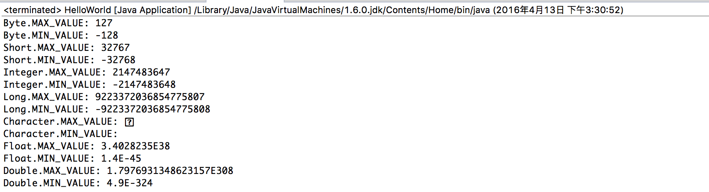
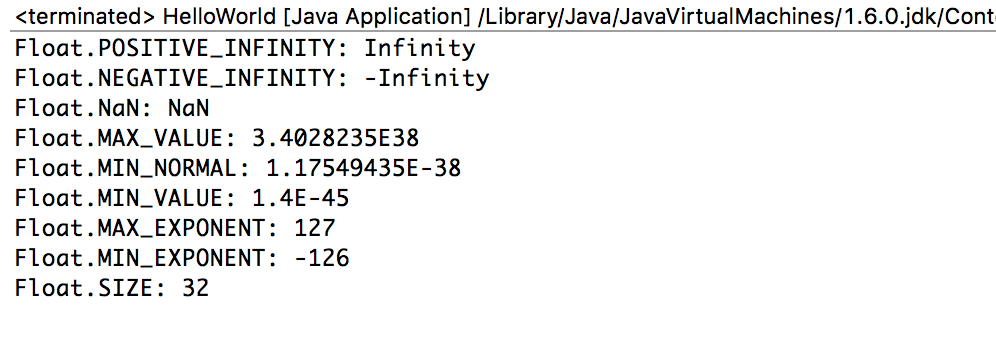
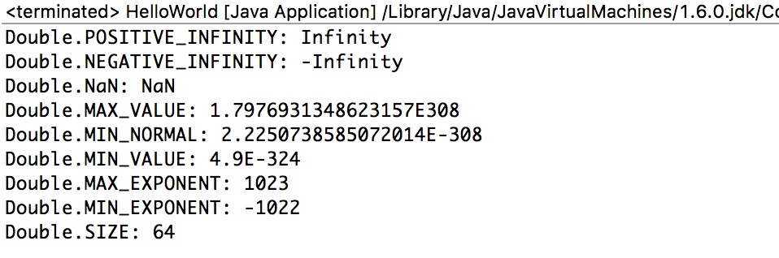

Java.lang中提供的以下几种类型的范围：**Byte, Integer, Long, Short, Character, Double, Float**.

<!--more-->

先放一段测试它们范围的代码及其结果，JDK1.6下: 
```java
public class Boundary {
	public static void main(String[] args) {
	    System.out.println("Byte.MAX_VALUE: " + Byte.MAX_VALUE);
	    System.out.println("Byte.MIN_VALUE: " + Byte.MIN_VALUE);
	    System.out.println("Short.MAX_VALUE: " + Short.MAX_VALUE);
	    System.out.println("Short.MIN_VALUE: " + Short.MIN_VALUE);
	    System.out.println("Integer.MAX_VALUE: " + Integer.MAX_VALUE);
	    System.out.println("Integer.MIN_VALUE: " + Integer.MIN_VALUE);
	    System.out.println("Long.MAX_VALUE: "+ Long.MAX_VALUE);
	    System.out.println("Long.MIN_VALUE: "+ Long.MIN_VALUE);
	    System.out.println("Character.MAX_VALUE: " + Character.MAX_VALUE);
	    System.out.println("Character.MIN_VALUE: " + Character.MIN_VALUE);
	    System.out.println("Float.MAX_VALUE: " + Float.MAX_VALUE);
	    System.out.println("Float.MIN_VALUE: " + Float.MIN_VALUE);
	    System.out.println("Double.MAX_VALUE: " + Double.MAX_VALUE);
	    System.out.println("Double.MIN_VALUE: " + Double.MIN_VALUE);
	}
}
```



提前提一句：由此可见，Float和Double型的MIN_VALUE并不是我们所谓的最小值(能表示的最小的负数)，而是正数中能表示的最小的值。

#### Byte: -2<sup>7</sup>~2<sup>7</sup>-1 (8位)

```java
    /**
     * A constant holding the minimum value a {@code byte} can
     * have, -2<sup>7</sup>.
     */
    public static final byte   MIN_VALUE = -128;
    /**
     * A constant holding the maximum value a {@code byte} can
     * have, 2<sup>7</sup>-1.
     */
    public static final byte   MAX_VALUE = 127;
```

#### Short: -2<sup>15</sup>~2<sup>15</sup>-1 (16位)

```java
    /**
     * A constant holding the minimum value a {@code short} can
     * have, -2<sup>15</sup>.
     */
    public static final short   MIN_VALUE = -32768;
    /**
     * A constant holding the maximum value a {@code short} can
     * have, 2<sup>15</sup>-1.
     */
    public static final short   MAX_VALUE = 32767;
```

#### Integer: -2<sup>31</sup>~2<sup>31</sup>-1 (32位)

```java
    /**
     * A constant holding the minimum value an {@code int} can
     * have, -2<sup>31</sup>.
     */
    @Native public static final int   MIN_VALUE = 0x80000000;
    /**
     * A constant holding the maximum value an {@code int} can
     * have, 2<sup>31</sup>-1.
     */
    @Native public static final int   MAX_VALUE = 0x7fffffff;
```

#### Long: -2<sup>63</sup>~2<sup>63</sup>-1 (64位)

```java
    /**
     * A constant holding the minimum value a {@code long} can
     * have, -2<sup>63</sup>.
     */
    @Native public static final long MIN_VALUE = 0x8000000000000000L;
    /**
     * A constant holding the maximum value a {@code long} can
     * have, 2<sup>63</sup>-1.
     */
    @Native public static final long MAX_VALUE = 0x7fffffffffffffffL;
```

#### Character: '\u0000'~'\uFFFF'  (16位)
Unicode: \u开头的是一个Unicode码的字符。

```java
    /**
     * The constant value of this field is the smallest value of type
     * {@code char}, {@code '\u005Cu0000'}.
     *
     * @since   1.0.2
     */
    public static final char MIN_VALUE = '\u0000';
    /**
     * The constant value of this field is the largest value of type
     * {@code char}, {@code '\u005CuFFFF'}.
     *
     * @since   1.0.2
     */
    public static final char MAX_VALUE = '\uFFFF';
```

#### Float:  数符1位，尾数23位，阶码8位，用移码表示。p代表以2为底。

```java
   /**
     * A constant holding the positive infinity of type
     * {@code float}. It is equal to the value returned by
     * {@code Float.intBitsToFloat(0x7f800000)}.
     */     
    public static final float POSITIVE_INFINITY = 1.0f / 0.0f;
    /**
     * A constant holding the negative infinity of type
     * {@code float}. It is equal to the value returned by
     * {@code Float.intBitsToFloat(0xff800000)}.
     */
    public static final float NEGATIVE_INFINITY = -1.0f / 0.0f;
    /**
     * A constant holding a Not-a-Number (NaN) value of type
     * {@code float}.  It is equivalent to the value returned by
     * {@code Float.intBitsToFloat(0x7fc00000)}.
     */
    public static final float NaN = 0.0f / 0.0f;
    /**
     * A constant holding the largest positive finite value of type
     * {@code float}, (2-2<sup>-23</sup>)&middot;2<sup>127</sup>.
     * It is equal to the hexadecimal floating-point literal
     * {@code 0x1.fffffeP+127f} and also equal to
     * {@code Float.intBitsToFloat(0x7f7fffff)}.
     */
    public static final float MAX_VALUE = 0x1.fffffeP+127f; // 3.4028235e+38f
    /**
     * A constant holding the smallest positive normal value of type
     * {@code float}, 2<sup>-126</sup>.  It is equal to the
     * hexadecimal floating-point literal {@code 0x1.0p-126f} and also
     * equal to {@code Float.intBitsToFloat(0x00800000)}.
     *
     * @since 1.6
     */
    public static final float MIN_NORMAL = 0x1.0p-126f; // 1.17549435E-38f
    /**
     * A constant holding the smallest positive nonzero value of type
     * {@code float}, 2<sup>-149</sup>. It is equal to the
     * hexadecimal floating-point literal {@code 0x0.000002P-126f}
     * and also equal to {@code Float.intBitsToFloat(0x1)}.
     */
    public static final float MIN_VALUE = 0x0.000002P-126f; // 1.4e-45f
    /**
     * Maximum exponent a finite {@code float} variable may have.  It
     * is equal to the value returned by {@code
     * Math.getExponent(Float.MAX_VALUE)}.
     *
     * @since 1.6
     */
    public static final int MAX_EXPONENT = 127;
    /**
     * Minimum exponent a normalized {@code float} variable may have.
     * It is equal to the value returned by {@code
     * Math.getExponent(Float.MIN_NORMAL)}.
     *
     * @since 1.6
     */
    public static final int MIN_EXPONENT = -126;
    /**
     * The number of bits used to represent a {@code float} value.
     *
     * @since 1.5
     */
    public static final int SIZE = 32;
    /**
     * The number of bytes used to represent a {@code float} value.
     *
     * @since 1.8
     */
    public static final int BYTES = SIZE / Byte.SIZE;
```
在JDK1.6下测试了上面的结果：


表示的含义分别是：
POSITIVE_INFINITY - 正无穷大
NEGATIVE_INFINITY - 负无穷大
NaN - Not a number 用于处理计算中出现的错误情况，比如 0.0 除以 0.0 或者求负数的平方根。
MAX_VALUE - 最大值
MIN_NORMAL - 规范的浮点数可以表示的最小正数( 0x1.0p-126f 规范的含义: 尾数的最高数位必须是一个有效值 )
MIN_VALUE - 实际可以表示的最小正数（ 0x0.000002P-126f 尾数的最高数位不需要是一个有效值)
MAX_EXPONENT - 最大的指数
MIN_EXPONENT - 最小的指数
SIZE - Float位数
BYTES - 提供给1.8版本以上，占的byte位数

+ 如果想要获得“可以表示的最小数”的宏定义，直接 -Float.MAX_VALUE，而不是 Float.MIN_VALUE。
+ Java使用二进制数据的科学计数法来存储浮点数，采用IEEE754标准，在存储某些值时会丧失精度，产生误差。如单精度类型只有32位，无法精确描述0.1。因此浮点数不适用要求精度的场合。
```java
double a = 0.1f;
System.out.println(40*a);//打印4.000000059604645
```
+ Java中浮点数不能用八进制表示，但可以用十六进制表示，只能用指数形式表示，double d = 0x4.0;错误的。double d = 0x7.3p8f √ ，指数不是用e或E，而是用p或P。 
float f = 03.2f;等价于float f = 3.2f; 因为没有八进制的浮点数。 
+ 浮点数不能用==比较，浮点数精度不准确 
+ 可能大的浮点数加一个很小的数数值不变 
关于MIN_NORMAL和MIN_VALUE的区别详见:<a href = "http://stackoverflow.com/questions/3728309/difference-between-double-min-normal-and-double-min-value"> Difference between Double.MIN_NORMAL and Double.MIN_VALUE </a>

#### Double: 数符1位，阶码11位，尾数数值52位，总位数64位。

```java
    /**
     * A constant holding the positive infinity of type
     * {@code double}. It is equal to the value returned by
     * {@code Double.longBitsToDouble(0x7ff0000000000000L)}.
     */
    public static final double POSITIVE_INFINITY = 1.0 / 0.0;
    /**
     * A constant holding the negative infinity of type
     * {@code double}. It is equal to the value returned by
     * {@code Double.longBitsToDouble(0xfff0000000000000L)}.
     */
    public static final double NEGATIVE_INFINITY = -1.0 / 0.0;
    /**
     * A constant holding a Not-a-Number (NaN) value of type
     * {@code double}. It is equivalent to the value returned by
     * {@code Double.longBitsToDouble(0x7ff8000000000000L)}.
     */
    public static final double NaN = 0.0d / 0.0;
    /**
     * A constant holding the largest positive finite value of type
     * {@code double},
     * (2-2<sup>-52</sup>)&middot;2<sup>1023</sup>.  It is equal to
     * the hexadecimal floating-point literal
     * {@code 0x1.fffffffffffffP+1023} and also equal to
     * {@code Double.longBitsToDouble(0x7fefffffffffffffL)}.
     */
    public static final double MAX_VALUE = 0x1.fffffffffffffP+1023; // 1.7976931348623157e+308
    /**
     * A constant holding the smallest positive normal value of type
     * {@code double}, 2<sup>-1022</sup>.  It is equal to the
     * hexadecimal floating-point literal {@code 0x1.0p-1022} and also
     * equal to {@code Double.longBitsToDouble(0x0010000000000000L)}.
     *
     * @since 1.6
     */
    public static final double MIN_NORMAL = 0x1.0p-1022; // 2.2250738585072014E-308
    /**
     * A constant holding the smallest positive nonzero value of type
     * {@code double}, 2<sup>-1074</sup>. It is equal to the
     * hexadecimal floating-point literal
     * {@code 0x0.0000000000001P-1022} and also equal to
     * {@code Double.longBitsToDouble(0x1L)}.
     */
    public static final double MIN_VALUE = 0x0.0000000000001P-1022; // 4.9e-324
    /**
     * Maximum exponent a finite {@code double} variable may have.
     * It is equal to the value returned by
     * {@code Math.getExponent(Double.MAX_VALUE)}.
     *
     * @since 1.6
     */
    public static final int MAX_EXPONENT = 1023;
    /**
     * Minimum exponent a normalized {@code double} variable may
     * have.  It is equal to the value returned by
     * {@code Math.getExponent(Double.MIN_NORMAL)}.
     *
     * @since 1.6
     */
    public static final int MIN_EXPONENT = -1022;
    /**
     * The number of bits used to represent a {@code double} value.
     *
     * @since 1.5
     */
    public static final int SIZE = 64;
    /**
     * The number of bytes used to represent a {@code double} value.
     *
     * @since 1.8
     */
    public static final int BYTES = SIZE / Byte.SIZE;
```
含义近似于Float里的含义。
在JDK1.6下测试了上面的结果：


