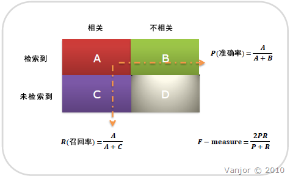

信息检索、分类、识别、翻译等领域两个的最基本指标是准确率(Precision Rate)和召回率(Recall Rate)，搞清楚这些指标对于评价检索和分类性能非常重要，在做一个比赛时，给的评定指标即包含了准确率与召回率，在一定程度上要根据每天评判的这两个值，进行训练集训练与优化。这里先初步的描述准确率与召回率，其他的评价指标不作详细介绍。

<!--more-->

召回率(R)也叫查全率，准确率(P)也叫查准率，P和R指标有时候会出现的矛盾的情况，这样就需要综合考虑他们，最常见的方法就是F-Measure（又称为F-Score）。公式:
> 召回率(Recall)    =  系统检索到的相关文件 / 系统所有相关的文件总数

> 准确率(Precision) =  系统检索到的相关文件 / 系统所有检索到的文件总数

当参数α=1时，就是最常见的F1，也即
```python
F1 = 2 * P * R / (P + R) （F值即为正确率和召回率的调和平均值）
```

可知F1综合了P和R的结果，当F1较高时则能说明试验方法比较有效。

假定：从一个大规模数据集合中检索文档时，可把文档分成四组，如图显示：
<center>  </center>
- 系统检索到的相关文档（A）
- 系统检索到的不相关文档（B）
- 相关但是系统没有检索到的文档（C）
- 不相关且没有被系统检索到的文档（D）

则：
- 召回率R：用检索到相关文档数作为分子，所有相关文档总数作为分母，即R = A / ( A + C )
- 精度P：用检索到相关文档数作为分子，所有检索到的文档总数作为分母．即P = A / ( A + B ).

不妨举这样一个例子：某池塘有1400条鲤鱼，300只虾，300只鳖。现在以捕鲤鱼为目的。撒一大网，逮着了700条鲤鱼，200只虾，100只鳖。那么，这些指标分别如下：
正确率 = 700 / (700 + 200 + 100) = 70%
召回率 = 700 / 1400 = 50%
F值 = 70% * 50% * 2 / (70% + 50%) = 58.3%
不妨看看如果把池子里的所有的鲤鱼、虾和鳖都一网打尽，这些指标又有何变化：
正确率 = 1400 / (1400 + 300 + 300) = 70%
召回率 = 1400 / 1400 = 100%
F值 = 70% * 100% * 2 / (70% + 100%) = 82.35%        

当然希望检索结果Precision越高越好，同时Recall也越高越好，但事实上这两者在某些情况下有矛盾的。比如极端情况下，我们只搜索出了一个结果，且是准确的，那么Precision就是100%，但是Recall就很低；而如果我们把所有结果都返回，那么比如Recall是100%，但是Precision就会很低。因此在不同的场合中需要自己判断希望Precision比较高或是Recall比较高。如果是做实验研究，可以绘制Precision-Recall曲线来帮助分析。

由此可见，准确率是评估捕获的成果中目标成果所占得比例；召回率，顾名思义，就是从关注领域中，召回目标类别的比例；而F值，则是综合这二者指标的评估指标，用于综合反映整体的指标。在不牺牲精度的情况下，获得一个高召回率是很困难的。

为什么会有这么多指标呢？
这是因为模式分类和机器学习的需要。判断一个分类器对所用样本的分类能力或者在不同的应用场合时，需要有不同的指标。 当总共有100个样本时，假如只有一个正例，那么只考虑召回率的话，不需要进行任何模型的训练，直接将所有测试样本判为正例，那么召回率可达很高，但这并没有反映出模型真正的能力。另外在统计信号分析中，对不同类的判断结果的错误的惩罚是不一样的。举例而言，雷达收到100个来袭导弹的信号，其中只有3个是真正的导弹信号，其余97个是敌方模拟的导弹信号。假如系统判断98个（97个模拟信号加一个真正的导弹信号）信号都是模拟信号，那么Accuracy=98%，很高了，剩下两个是导弹信号，被截掉，这时Recall=2/3=66.67%，Precision=2/2=100%，Precision也很高。但剩下的那颗导弹就会造成灾害。 如果是做搜索，那就是保证召回的情况下提升准确率；如果做疾病监测、反垃圾，则是保准确率的条件下，提升召回。
所以，在两者都要求高的情况下，可以用F值来衡量。

参考自：
百度百科：http://baike.baidu.com/view/29947.htm
http://blog.csdn.net/wangzhiqing3/article/details/9058523
http://bookshadow.com/weblog/2014/06/10/precision-recall-f-measure/
