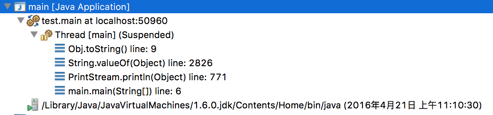

toString(): 调用时默认为**类名+@+hashCode值**，是由Object类(package java.lang)提供的。如果需要自定义toString的内容,就必须重写该方法。

```java
// Object类里的toString()函数
public String toString() {
    return getClass().getName() + "@" + Integer.toHexString(hashCode());
}
```

关于 System.out.println() 与 toString():
这里debug了两种情况:
```java
package test;
class Obj{
	private String str = "default value";
	public String toString (){
		return str;
	}
}
public class TestRef {
	private Obj aObj = new Obj();
	public Obj getAObj(){
		return aObj;
	}
}
```

```java
package test;
public class main {
	public static void main(String[] args){
		TestRef oRef = new TestRef();
		System.out.println(oRef.getAObj());			System.out.println("" + oRef.getAObj());
	}
}
```
两次输出的结果都是 "default value"，但是执行的步骤不尽相同。
对于 System.out.println(oRef.getAObj()), debug的结果:

对于 System.out.println("" + oRef.getAObj()), debug的结果:

也就是说，对于第一种情况，System.out.println()内部调用了toString()；对于第二种情况，加法默认调用了toString()。
对于第一种情况，程序执行System.out.println(Object x)，函数调用了String.valueOf(Object x)函数，valueOf()函数再调用了toString()函数。
```java
public void println(Object x) {
    String s = String.valueOf(x);
    synchronized (this) {
        print(s);
        newLine();
    }
}
```

下面列了System.out.println()的一些相关Java源码:
System类中对out变量的定义:
```java
	// 标准输出流，该流已经打开并准备接受输出数据。
	// System.out.println()由重构实现。
    /**
     * The "standard" output stream. This stream is already
     * open and ready to accept output data. Typically this stream
     * corresponds to display output or another output destination
     * specified by the host environment or user.
     * <p>
     * For simple stand-alone Java applications, a typical way to write
     * a line of output data is:
     * <blockquote><pre>
     *     System.out.println(data)
     * </pre></blockquote>
     * <p>
     * See the <code>println</code> methods in class <code>PrintStream</code>.
     *
     * @see     java.io.PrintStream#println()
     * @see     java.io.PrintStream#println(boolean)
     * @see     java.io.PrintStream#println(char)
     * @see     java.io.PrintStream#println(char[])
     * @see     java.io.PrintStream#println(double)
     * @see     java.io.PrintStream#println(float)
     * @see     java.io.PrintStream#println(int)
     * @see     java.io.PrintStream#println(long)
     * @see     java.io.PrintStream#println(java.lang.Object)
     * @see     java.io.PrintStream#println(java.lang.String)
     */
    public final static PrintStream out = null;
```
再来看PrintStream的println()函数:
```java
    public void println(String x) {
        synchronized (this) {
            print(x);
            newLine();
        }
    }
   public void println(Object x) {
        String s = String.valueOf(x);
        synchronized (this) {
            print(s);
            newLine();
        }
    }
```
这里就列出了相关的两个println()函数，其他类似。这里参数为对象时，有一个**对象向toString()转换**的功能，可见默认调用了String.valueOf(x)。
println(Object x)函数中String.valueOf(Object x)函数源码:
```java
    public static String valueOf(Object obj) {
        return (obj == null) ? "null" : obj.toString();
    }
```
Object类的toString源码即文章最开始提及的。
println()函数中newLine()函数具体为:
```
// 暂未看到io方面的，未继续解析 = =，大概就是判断输出流是否打开，缓存输出数据(换行)并输出。
    private void newLine() {
        try {
            synchronized (this) {
                ensureOpen();
                textOut.newLine();
                textOut.flushBuffer();
                charOut.flushBuffer();
                if (autoFlush)
                    out.flush();
            }
        }
        catch (InterruptedIOException x) {
            Thread.currentThread().interrupt();
        }
        catch (IOException x) {
            trouble = true;
        }
    }
```
而print()函数源码是:
```java
    public void print(String s) {
        if (s == null) {
            s = "null";
        }
        write(s);
    }
```
输出字符串s, 如果字符串为null关键字，则传给s的是null字符串。
-> write()函数:
```java
    private void write(String s) {
        try {
            synchronized (this) {
                ensureOpen();
                textOut.write(s);
                textOut.flushBuffer();
                charOut.flushBuffer();
                if (autoFlush && (s.indexOf('\n') >= 0))
                    out.flush();
            }
        }
        catch (InterruptedIOException x) {
            Thread.currentThread().interrupt();
        }
        catch (IOException x) {
            trouble = true;
        }
    }
```