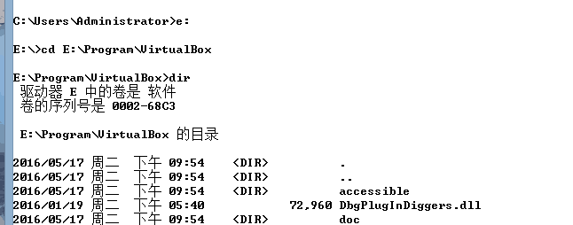
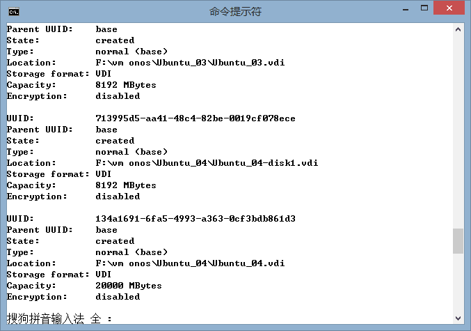
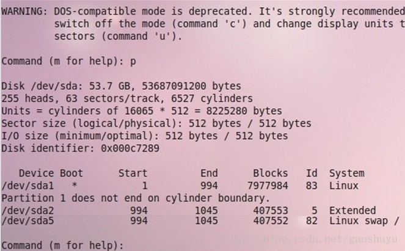

之前VirtualBox上装的虚拟机硬盘总在报错，发现初始化时只分配了8G(因为当时要装几个跑集群，就分配少了点)，现在mvn clean install一个helloworld，纯helloworld包就占了500M，更别提.m2里下载的，就打算扩容了。

网上有参考资料，也参考了些，但出了些问题，自己写篇记录下过程。

<!--more-->

预置条件：
虚拟机：Oracle VM VirtualBox
OS：Ubuntu 12.04
虚拟硬盘：动态分配存储

先置条件:
**不能有备份，snapshoot需要全删除（就像改备份地址时也需要先全删除）** 开始时由于有备份，参照以下步骤操作时，VirtualBox中显示已扩容，但Linux下使用fdisk后也并没有显示扩容，还是8G。如果备份删除不彻底或者懒得删除的话，可以再复制一个相同的当前状态，再进行扩容。也可能针对snapshoot的UUID扩容的话，就不需要删除snapshoot了。

扩展步骤：
第一步：修改硬盘镜像文件
Ⅰ、虚拟机关机.
Ⅱ、确认虚拟机使用文件(后缀为.vdi的文件)路径不带中文字符．
Ⅲ、Windows下按：Windows+R，调出命令行工具，进入VirtualBox安装目录，可以使用***dir***命令查看当前文件夹下是否有VBoxManage.exe
<center></center>
Ⅳ、运行命令，结果如图(图中是已扩容为20000MB的硬盘):
```
VBoxManage list hdds
```
<center></center>
根据虚拟机名称及存储地址，找到需要扩展硬盘的虚拟机，获得映像的UUID。这里UUID是：134a1691-6fa5-r993-a363-0cf3bdb861d3。
Ⅴ、运行命令格式为:
```
VBoxManage modifyhd [UUID] --resize [Capacity-容量]
```

这里为
```
VBoxManage modifyhd 134a1691-6fa5-r993-a363-0cf3bdb861d3 --resize 51200
```
操作成功后，可以在VirtualBox管理器界面中该虚拟机的存储栏看到硬盘已经增加到50G，但此50G空间还没有完全分配。也就是说，开启虚拟机后，显示的存储空间仍为8GB.

第二步：分区
Ⅰ. 虚拟机开机．
Ⅱ. 查看磁盘情况：
```
$df -ah  #可以看到磁盘还是7G多，没有增加
```
虽然已经扩大了磁盘，但是由于还没有经过分区，指定文件系统[格式化]，所以linux操作系统无法识别（其实就相当于你插入了一块新硬盘，但是你并没有对其进行分区、格式化是一个道理）。
Ⅲ. 开始分区
```
$sudo fdisk /dev/sda
Disk /dev/sda: 53.7 GB, 53687091200 bytes  #磁盘总量确实增加到了50G
```
在Command后输入n(添加新分区)，回车：
```
Command action
  l   logical (5 or over)
  p   primary partition (1-4)
```
<center></center>
从上图可以看到: sda1、sda2、sda5三个分区，而1-4中只用了1和2，所以该步可以选primary partition ，输入:p
Ⅳ. 剩下步骤全按回车默认，把多出来的空间分成一个分区，然后保存分区信息：
```
Command:w             #保存并退出，分区划分完毕
WARNING: Re-reading the partition table failed with error 16: 设备或资源忙.
The kernel still uses the old table. The new table will be used at the next reboot or after you run partprobe(8) or kpartx(8) Syncing disks.                                                
$ partprobe      #我们不想重启系统，可以运行partprobe命令
```
于是我们得到一个可用的块设备文件: /dev/sda3

第三步：格式化并挂载
Ⅰ. 格式化分区
```
$sudo mkfs -t ext4 /dev/sda3
```
Ⅱ. 挂载分区
```
$sudo  mount  /dev/sda3  /home/ycy/workspace
```
Ⅲ. 开机自动挂载，则修改/etc/fstab文件，在这个文件里面添加一行：
```
/dev/sda3   /home/ycy/workspace    ext4    defaults        0       1
```
至此，容量扩展完成。

使用GParted Partition Editor可以看到硬盘变化的全部过程。（应该也可以配置的，但摸索着没配置出来）

参考：[VirtualBox 扩展虚拟硬盘容量](http://blog.csdn.net/ganshuyu/article/details/17954733)